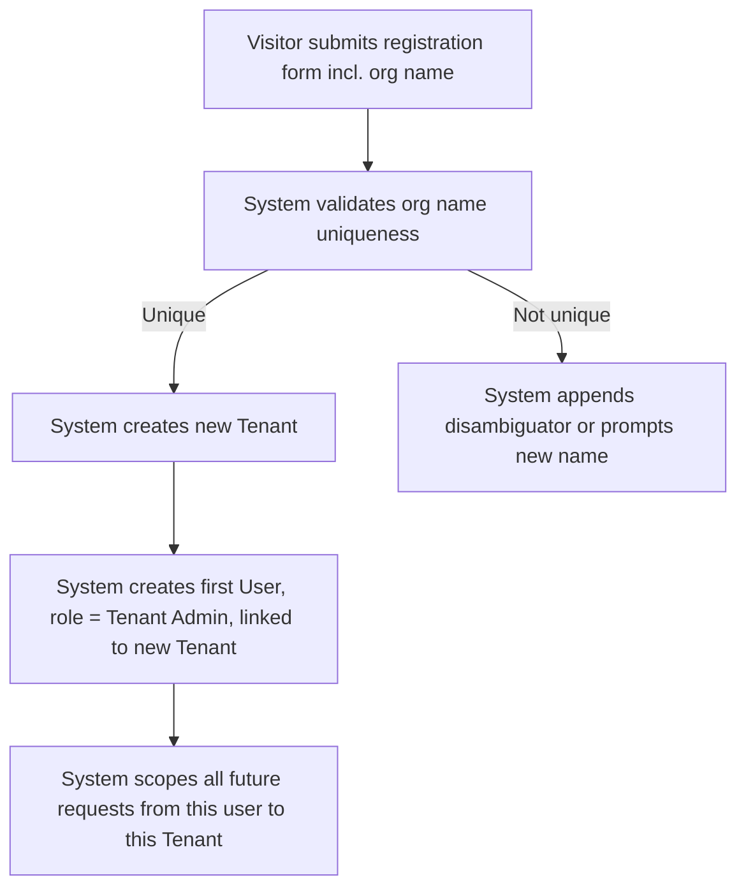
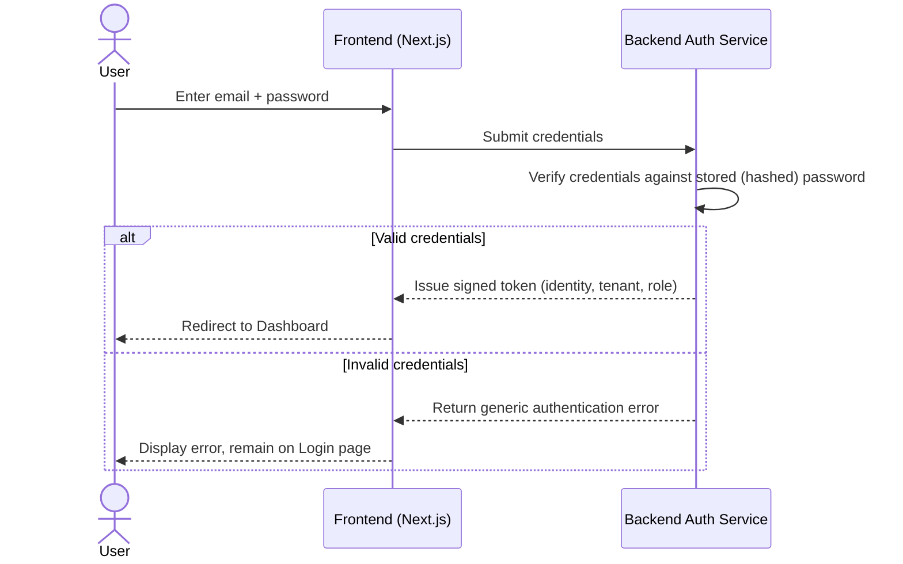
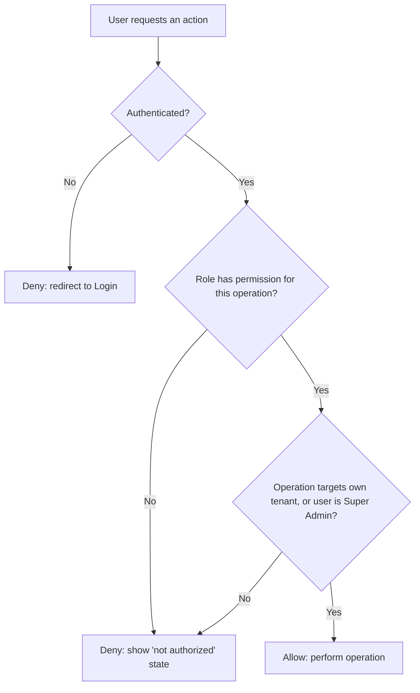
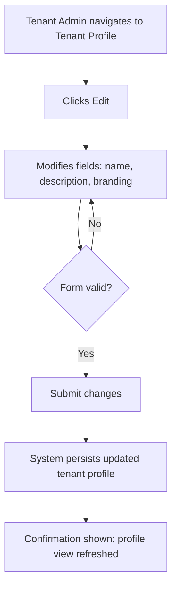
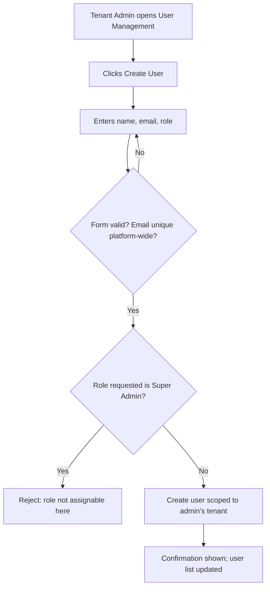
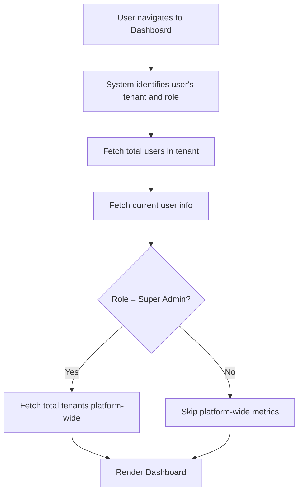
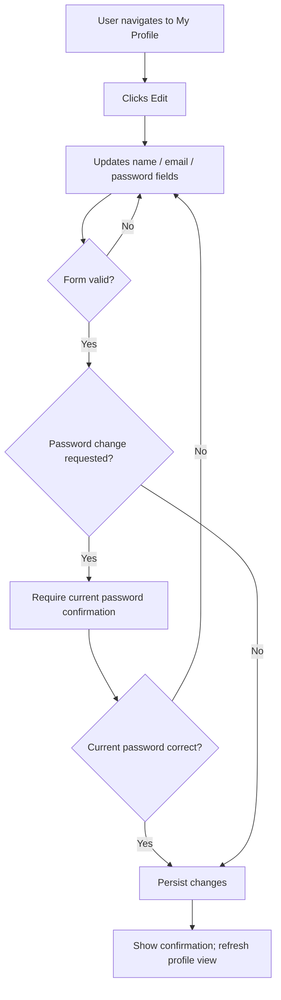
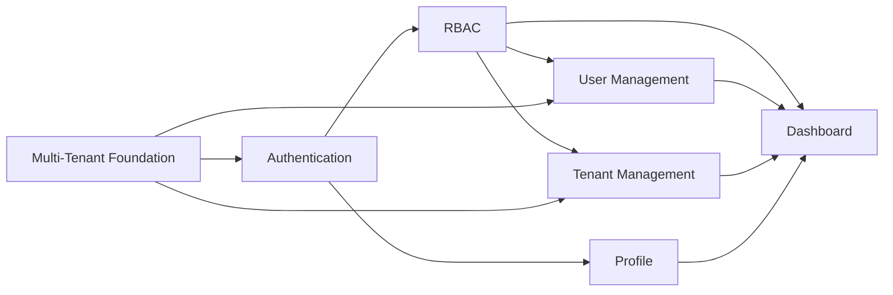

# Feature Requirements Document (FRD)
## Multi-Tenant SaaS MVP

| | |
|---|---|
| **Document Type** | Feature Requirements Document |
| **Product** | Multi-Tenant SaaS MVP |
| **Version** | 1.0 |
| **Status** | Draft — For Review |
| **Owner** | Product Management |
| **Last Updated** | July 2026 |
| **Audience** | Product Managers, Designers, Engineers, QA |
| **Scope Note** | This document is implementation-independent. No database schema, API contracts, or code are included. |

---

## Table of Contents

1. [Document Purpose](#1-document-purpose)
2. [Actors & Roles Overview](#2-actors--roles-overview)
3. [Comprehensive RBAC Permission Matrix](#3-comprehensive-rbac-permission-matrix)
4. [Feature 1: Multi-Tenant Foundation](#feature-1-multi-tenant-foundation)
5. [Feature 2: Authentication](#feature-2-authentication)
6. [Feature 3: Role-Based Access Control (RBAC)](#feature-3-role-based-access-control-rbac)
7. [Feature 4: Tenant Management](#feature-4-tenant-management)
8. [Feature 5: User Management](#feature-5-user-management)
9. [Feature 6: Dashboard](#feature-6-dashboard)
10. [Feature 7: Profile](#feature-7-profile)
11. [Cross-Feature Dependency Map](#11-cross-feature-dependency-map)
12. [Global Business Rules](#12-global-business-rules)
13. [Appendix: Change Log](#13-appendix-change-log)

---

## 1. Document Purpose

This Feature Requirements Document (FRD) decomposes the Multi-Tenant SaaS MVP into its constituent features and specifies, for each, the exact behavior expected of the system. It is the primary reference for engineering implementation, QA test-case design, and stakeholder sign-off. It complements the Product Requirements Document (PRD) by providing feature-level depth rather than product-level strategy.

**Technology context** (for orientation only — this document remains implementation-independent):

| Layer | Stack |
|---|---|
| Backend Runtime/Framework | Bun, Elysia.js |
| Database/ORM | PostgreSQL, Drizzle ORM |
| Auth | JWT |
| Frontend Framework | Next.js (App Router), TypeScript |
| UI | Tailwind CSS, shadcn/ui |
| Data/Forms | TanStack Query, React Hook Form, Zod |

---

## 2. Actors & Roles Overview

| Actor | Definition |
|---|---|
| **Visitor** | An unauthenticated person interacting with public pages (register/login) |
| **Member** | Authenticated user with standard, self-service permissions within one tenant |
| **Tenant Admin** | Authenticated user with full administrative control within one tenant |
| **Super Admin** | Authenticated internal platform operator with cross-tenant visibility and control |
| **System** | Automated platform behavior not directly triggered by a human actor (e.g., token expiry, default role assignment) |

---

## 3. Comprehensive RBAC Permission Matrix

This matrix consolidates permissions across **every feature and operation** in the MVP. Feature-specific tables in later sections restate the relevant subset for convenience.

| # | Feature | Operation | Super Admin | Tenant Admin | Member | Visitor |
|---|---|---|:---:|:---:|:---:|:---:|
| 1 | Multi-Tenant | Create tenant (via registration) | ✅ | ✅ | ❌ | ✅ |
| 2 | Multi-Tenant | Access data across tenants | ✅ | ❌ | ❌ | ❌ |
| 3 | Authentication | Register | N/A | N/A | N/A | ✅ |
| 4 | Authentication | Login | ✅ | ✅ | ✅ | ✅ (attempt only) |
| 5 | Authentication | Logout | ✅ | ✅ | ✅ | ❌ |
| 6 | Authentication | Access protected routes | ✅ | ✅ | ✅ | ❌ |
| 7 | RBAC | View own role | ✅ | ✅ | ✅ | ❌ |
| 8 | RBAC | Assign Member ↔ Tenant Admin role | ✅ | ✅ | ❌ | ❌ |
| 9 | RBAC | Assign/revoke Super Admin role | ✅ | ❌ | ❌ | ❌ |
| 10 | Tenant Management | View own tenant profile | ✅ | ✅ | ✅ | ❌ |
| 11 | Tenant Management | Update own tenant profile | ✅ | ✅ | ❌ | ❌ |
| 12 | Tenant Management | View all tenants (platform-wide) | ✅ | ❌ | ❌ | ❌ |
| 13 | User Management | View users in own tenant | ✅ | ✅ | ❌ | ❌ |
| 14 | User Management | View users across all tenants | ✅ | ❌ | ❌ | ❌ |
| 15 | User Management | Create user in own tenant | ✅ | ✅ | ❌ | ❌ |
| 16 | User Management | Edit user in own tenant | ✅ | ✅ | ❌ | ❌ |
| 17 | User Management | Delete/deactivate user in own tenant | ✅ | ✅ | ❌ | ❌ |
| 18 | User Management | Edit/delete user in another tenant | ✅ | ❌ | ❌ | ❌ |
| 19 | Dashboard | View tenant-level metrics | ✅ | ✅ | ✅ (limited) | ❌ |
| 20 | Dashboard | View platform-wide metrics (total tenants) | ✅ | ❌ | ❌ | ❌ |
| 21 | Profile | View own profile | ✅ | ✅ | ✅ | ❌ |
| 22 | Profile | Edit own profile (name, email, password) | ✅ | ✅ | ✅ | ❌ |
| 23 | Profile | Edit own role via profile | ❌ | ❌ | ❌ | ❌ |

**Legend:** ✅ = Permitted · ❌ = Not Permitted · N/A = Not applicable to this actor state

---

## Feature 1: Multi-Tenant Foundation

### 1.1 Feature Overview
Establishes the concept of a "tenant" (organization) as the primary boundary for data ownership and access. Every piece of tenant-scoped data in the system belongs to exactly one tenant, and every authenticated request is automatically scoped to the requester's tenant.

### 1.2 Purpose
To guarantee that organizations sharing the same application instance can never view, modify, or infer one another's data, enabling the platform to safely serve multiple customers from shared infrastructure.

### 1.3 Actors / Roles
- Visitor (creates a tenant during registration)
- Member, Tenant Admin (operate within their tenant)
- Super Admin (operates across tenants)
- System (enforces scoping automatically)

### 1.4 Functional Requirements

| ID | Requirement |
|---|---|
| MT-FR-01 | The system shall allow a new tenant to be created as part of the registration process |
| MT-FR-02 | Each tenant shall have a unique, human-readable identifier (e.g., name/slug) |
| MT-FR-03 | Every tenant-owned record shall be associated with exactly one tenant |
| MT-FR-04 | The system shall automatically scope every authenticated request to the requester's tenant, without relying on client-supplied tenant identifiers |
| MT-FR-05 | The system shall prevent any operation that would return, modify, or reference data belonging to a tenant other than the requester's, except for the Super Admin role |
| MT-FR-06 | The system shall support an unlimited number of tenants within the MVP's operational limits |

### 1.5 Preconditions
- None for tenant creation (available to any Visitor completing registration).
- For all other operations: the actor must be authenticated and associated with a tenant.

### 1.6 Postconditions
- A new tenant exists with a unique identifier.
- The creating user is associated with the new tenant as its initial Tenant Admin.
- All subsequent actions by users of this tenant are automatically scoped to it.

### 1.7 Main User Flow — Tenant Creation (via Registration)

### 1.8 Alternative Flows

| Flow | Trigger | System Behavior |
|---|---|---|
| Duplicate organization name | Two visitors submit the same org name | System generates a unique identifier variant (e.g., suffixed) or prompts the user to adjust |
| Super Admin cross-tenant lookup | Super Admin requests platform-wide data | System bypasses single-tenant scoping and returns aggregated/multi-tenant results |

### 1.9 Business Rules

| ID | Rule |
|---|---|
| MT-BR-01 | A user belongs to exactly one tenant |
| MT-BR-02 | Tenant scoping is derived from the authenticated session, never from user-editable input |
| MT-BR-03 | Only the Super Admin role may view or act across multiple tenants |
| MT-BR-04 | A tenant cannot be created without at least one associated user (its initial Tenant Admin) |

### 1.10 Validation Rules

| Field | Rule |
|---|---|
| Organization Name | Required; minimum 2 characters; maximum 100 characters; must be unique platform-wide |

### 1.11 Role Permissions

| Operation | Super Admin | Tenant Admin | Member |
|---|:---:|:---:|:---:|
| Create tenant | ✅ (via registration) | ✅ (via registration) | ❌ |
| Access own tenant's data | ✅ | ✅ | ✅ |
| Access other tenants' data | ✅ | ❌ | ❌ |

### 1.12 Success Criteria
- 100% of tenant-scoped operations return only data belonging to the requester's tenant (except Super Admin).
- Zero incidents of cross-tenant data exposure in QA and production monitoring.

### 1.13 Error & Empty States

| Scenario | System Response |
|---|---|
| Organization name already taken | Clear validation message; suggest alternative or allow retry |
| Attempt to access another tenant's resource | Access denied response; no indication of whether the resource exists |
| Tenant has no associated data yet (e.g., new org) | Empty state shown gracefully (e.g., "No users yet — invite your team") |

### 1.14 Edge Cases
- Two registrations for the same organization name submitted simultaneously (race condition) — system must resolve deterministically without creating duplicate tenants with identical identifiers.
- A tenant with only one user attempts an operation that would leave it with zero active users (see User Management business rules).
- Super Admin impersonating tenant-scoped views must be clearly indicated in the UI to avoid confusion about data origin.

### 1.15 Dependencies
- Depends on: Authentication (Feature 2), since tenant creation occurs during registration.
- Required by: All other features (Tenant Management, User Management, Dashboard, Profile) rely on tenant scoping.

### 1.16 Future Enhancements
- Support for users belonging to multiple tenants with tenant-switching.
- Tenant-level custom domains/subdomains.
- Tenant archival/suspension workflow.

---

## Feature 2: Authentication

### 2.1 Feature Overview
Provides secure identity verification allowing users to register, log in, log out, and access protected areas of the application via a token-based session model.

### 2.2 Purpose
To ensure that only verified, authorized individuals can access tenant data and platform features, forming the security foundation for every other feature.

### 2.3 Actors / Roles
- Visitor (register, login)
- Member, Tenant Admin, Super Admin (login, logout, access protected routes)

### 2.4 Functional Requirements

| ID | Requirement |
|---|---|
| AUTH-FR-01 | The system shall allow a Visitor to register with name, email, password, and organization name |
| AUTH-FR-02 | The system shall allow a registered user to log in using email and password |
| AUTH-FR-03 | The system shall issue a signed authentication token upon successful login, encoding the user's identity, tenant, and role |
| AUTH-FR-04 | The system shall allow an authenticated user to log out, ending their active session |
| AUTH-FR-05 | The system shall restrict access to protected routes/features to authenticated users only |
| AUTH-FR-06 | The system shall reject expired, malformed, or tampered authentication tokens |
| AUTH-FR-07 | The system shall never store or transmit passwords in plaintext |

### 2.5 Preconditions
- **Register:** No existing account with the same email.
- **Login:** A registered, active account exists.
- **Logout / Protected route access:** User currently holds a valid authentication token.

### 2.6 Postconditions
- **Register:** New User and (if applicable) new Tenant exist; user is authenticated.
- **Login:** User holds a valid session token and is redirected to the Dashboard.
- **Logout:** Session token is invalidated/cleared; user is redirected to the login page.

### 2.7 Main User Flow — Login

### 2.8 Alternative Flows

| Flow | Trigger | System Behavior |
|---|---|---|
| Registration with existing email | Email already registered | Reject with clear validation error; no account created |
| Access protected route while unauthenticated | Visitor navigates directly to a protected URL | Redirect to Login; optionally preserve intended destination for post-login redirect |
| Token expiration during active session | Token TTL elapses mid-session | User is signed out and prompted to log in again on next protected action |
| Repeated failed login attempts | 5+ consecutive failures | System applies temporary rate-limiting/lockout (Should Have) |

### 2.9 Business Rules

| ID | Rule |
|---|---|
| AUTH-BR-01 | Email addresses are unique across the entire platform, not just within a tenant |
| AUTH-BR-02 | The first user of a newly created tenant is automatically assigned the Tenant Admin role |
| AUTH-BR-03 | Authentication tokens have a defined expiry and must be renewed or re-issued via re-login |
| AUTH-BR-04 | Logout invalidates the session on the client; server-side token invalidation strategy (e.g., short expiry) limits residual validity |
| AUTH-BR-05 | Failed login attempts must not reveal whether the email or password was incorrect |

### 2.10 Validation Rules

| Field | Rule |
|---|---|
| Name | Required; 2–100 characters |
| Email | Required; valid email format; unique platform-wide |
| Password | Required; minimum 8 characters; must include a mix of letter and number characters (policy configurable) |
| Organization Name | Required for registration; 2–100 characters |

### 2.11 Role Permissions

| Operation | Super Admin | Tenant Admin | Member | Visitor |
|---|:---:|:---:|:---:|:---:|
| Register | N/A | N/A | N/A | ✅ |
| Login | ✅ | ✅ | ✅ | ✅ (attempt) |
| Logout | ✅ | ✅ | ✅ | ❌ |
| Access protected routes | ✅ | ✅ | ✅ | ❌ |

### 2.12 Success Criteria
- 100% of protected routes/actions reject unauthenticated requests.
- Login success rate for valid credentials ≥ 99.5% (excluding intentional lockouts).
- Zero instances of plaintext password storage or transmission found in audits.

### 2.13 Error & Empty States

| Scenario | System Response |
|---|---|
| Invalid credentials | Generic "invalid email or password" message |
| Duplicate email at registration | "An account with this email already exists" |
| Expired/invalid token on protected route | Redirect to Login with a session-expired notice |
| Empty login/registration form submitted | Inline field-level validation errors |

### 2.14 Edge Cases
- User attempts to register while already holding a valid session (should be blocked or auto-redirected to Dashboard).
- User's account is deactivated by an admin while they hold an active session — next protected action must deny access.
- Simultaneous login from multiple devices — permitted in MVP; no single-session enforcement.
- Password containing edge-case characters (unicode, emoji) — must be handled per validation policy without server errors.

### 2.15 Dependencies
- Required by: Every other feature (all protected functionality depends on authentication state).
- Depends on: Multi-Tenant Foundation (registration creates a tenant).

### 2.16 Future Enhancements
- Password reset ("forgot password") flow.
- Multi-factor authentication (MFA).
- Social login / SSO (Google, Microsoft, SAML).
- Session/device management ("log out of all devices").

---

## Feature 3: Role-Based Access Control (RBAC)

### 3.1 Feature Overview
Defines and enforces three distinct roles — Super Admin, Tenant Admin, Member — that govern what actions a user may perform and what data they may access, both within their tenant and, for Super Admin, across the platform.

### 3.2 Purpose
To ensure that access to sensitive operations (user management, tenant configuration, platform oversight) is limited to appropriately privileged users, reducing risk of accidental or malicious misuse.

### 3.3 Actors / Roles
- Super Admin, Tenant Admin, Member (all subject to RBAC enforcement)

### 3.4 Functional Requirements

| ID | Requirement |
|---|---|
| RBAC-FR-01 | The system shall support exactly three roles: Super Admin, Tenant Admin, Member |
| RBAC-FR-02 | Every protected feature/operation shall define a minimum required role |
| RBAC-FR-03 | The system shall deny access by default to any operation lacking an explicit permission grant |
| RBAC-FR-04 | The frontend shall conditionally display or hide UI elements based on the current user's role |
| RBAC-FR-05 | The system shall independently re-verify role permissions on every request, regardless of frontend UI state |
| RBAC-FR-06 | Only a Super Admin may assign or revoke the Super Admin role |

### 3.5 Preconditions
- User is authenticated and holds one of the three defined roles.

### 3.6 Postconditions
- Access is granted or denied consistently with the user's role for the requested operation.

### 3.7 Main User Flow — Access Decision

### 3.8 Alternative Flows

| Flow | Trigger | System Behavior |
|---|---|---|
| Role changed mid-session | Admin updates a user's role while they are logged in | Change takes effect on next token refresh/re-login; system should communicate this to admins |
| Attempt to self-elevate role | Tenant Admin/Member attempts to change their own role | Rejected; role changes must be performed by another authorized actor |

### 3.9 Business Rules

| ID | Rule |
|---|---|
| RBAC-BR-01 | A user holds exactly one role at any given time |
| RBAC-BR-02 | Role checks are enforced independently of any client-side state |
| RBAC-BR-03 | A tenant must always retain at least one active Tenant Admin |
| RBAC-BR-04 | Super Admin role assignment occurs outside standard Tenant Admin-facing workflows |
| RBAC-BR-05 | Default behavior for any unspecified operation is denial, not access |

### 3.10 Validation Rules
Not applicable directly (RBAC governs authorization, not data input); however, role values submitted in any user-management operation must match one of the three defined roles exactly.

### 3.11 Role Permissions
See [Section 3: Comprehensive RBAC Permission Matrix](#3-comprehensive-rbac-permission-matrix) for the complete cross-feature matrix.

### 3.12 Success Criteria
- 100% of features tested confirm correct allow/deny behavior for all three roles.
- Zero unauthorized operations succeed during penetration/QA testing.

### 3.13 Error & Empty States

| Scenario | System Response |
|---|---|
| Unauthorized operation attempted | Clear "you do not have permission to perform this action" message |
| UI element hidden due to role, but underlying action attempted anyway (e.g., via replay) | Server-side denial regardless of how the request was made |

### 3.14 Edge Cases
- A Tenant Admin demotes themselves to Member while being the sole admin — must be blocked (see RBAC-BR-03).
- A user's role is changed by two admins simultaneously with conflicting values — last valid write should apply consistently.
- Super Admin views a tenant's data in an "impersonation" style view — must remain clearly labeled as Super Admin context.

### 3.15 Dependencies
- Depends on: Authentication (role is encoded in the session/token).
- Required by: Tenant Management, User Management, Dashboard (role-gated views).

### 3.16 Future Enhancements
- Custom/configurable roles beyond the fixed three.
- Granular, resource-level permission overrides.
- Permission delegation (temporary elevated access).

---

## Feature 4: Tenant Management

### 4.1 Feature Overview
Allows users to view their organization's profile information, and allows Tenant Admins to update it. Super Admins can additionally view all tenants on the platform.

### 4.2 Purpose
To give organizations control over their own identity/settings within the platform, and to give platform operators visibility into the overall tenant base.

### 4.3 Actors / Roles
- Member, Tenant Admin (view own tenant)
- Tenant Admin (update own tenant)
- Super Admin (view all tenants)

### 4.4 Functional Requirements

| ID | Requirement |
|---|---|
| TEN-FR-01 | The system shall allow any authenticated user to view their own tenant's profile |
| TEN-FR-02 | The system shall allow a Tenant Admin to update their tenant's profile information (name, description, branding fields) |
| TEN-FR-03 | The system shall allow a Super Admin to view a list of all tenants on the platform |
| TEN-FR-04 | The system shall prevent Members from modifying tenant profile data |
| TEN-FR-05 | The system shall prevent any user (other than Super Admin) from viewing tenants they do not belong to |

### 4.5 Preconditions
- User is authenticated.
- For update: user holds the Tenant Admin (or Super Admin) role.

### 4.6 Postconditions
- **View:** Tenant profile data is displayed accurately and current.
- **Update:** Tenant profile reflects the submitted changes; confirmation is shown.

### 4.7 Main User Flow — Update Tenant Profile

### 4.8 Alternative Flows

| Flow | Trigger | System Behavior |
|---|---|---|
| Member attempts to edit tenant profile | Non-admin accesses edit controls directly | Action blocked; edit controls not rendered, and server denies the request if attempted |
| Super Admin browses all tenants | Super Admin opens platform-wide tenant list | System returns a paginated list of all tenants, independent of the admin's own tenant |
| Cancel edit mid-way | User clicks "Cancel" before submitting | No changes are persisted; view reverts to last saved state |

### 4.9 Business Rules

| ID | Rule |
|---|---|
| TEN-BR-01 | Only Tenant Admins (and Super Admin) may modify tenant profile data |
| TEN-BR-02 | Tenant name must remain unique platform-wide after updates |
| TEN-BR-03 | A tenant profile always has at least a name; other fields are optional |

### 4.10 Validation Rules

| Field | Rule |
|---|---|
| Tenant Name | Required; 2–100 characters; unique platform-wide |
| Description | Optional; maximum 500 characters |
| Branding (e.g., logo) | Optional; must meet defined file type/size constraints if applicable |

### 4.11 Role Permissions

| Operation | Super Admin | Tenant Admin | Member |
|---|:---:|:---:|:---:|
| View own tenant profile | ✅ | ✅ | ✅ |
| Update own tenant profile | ✅ | ✅ | ❌ |
| View all tenants (platform-wide) | ✅ | ❌ | ❌ |

### 4.12 Success Criteria
- 100% of tenant profile updates by authorized roles persist correctly and are reflected immediately in the UI.
- Zero unauthorized profile modifications recorded in QA/security testing.

### 4.13 Error & Empty States

| Scenario | System Response |
|---|---|
| Duplicate tenant name on update | Validation error; update rejected |
| Member attempts update via direct action | Access denied response |
| Tenant list empty (Super Admin view, hypothetically) | Not expected post-launch, but system should show a graceful empty state rather than an error |

### 4.14 Edge Cases
- Tenant Admin updates the tenant name to one already used by a different (unrelated) tenant — must be blocked.
- Concurrent edits to the same tenant profile by two Tenant Admins — last valid submission wins; no data corruption.
- Super Admin's tenant list must correctly reflect tenants created moments earlier (no stale cache issues).

### 4.15 Dependencies
- Depends on: Multi-Tenant Foundation, Authentication, RBAC.
- Related to: Dashboard (tenant name/branding may be surfaced there).

### 4.16 Future Enhancements
- Tenant-level settings (timezone, locale, notification preferences).
- Tenant deactivation/archival workflow.
- Custom domain configuration per tenant.

---

## Feature 5: User Management

### 5.1 Feature Overview
Enables Tenant Admins to manage the roster of users within their organization — viewing, creating, editing, deleting, and assigning roles to team members. Super Admins can additionally view users across all tenants.

### 5.2 Purpose
To give organizations self-service control over who has access to their workspace and what level of privilege each person holds.

### 5.3 Actors / Roles
- Tenant Admin (full CRUD + role assignment within own tenant)
- Super Admin (cross-tenant visibility)
- Member (no access to this feature)

### 5.4 Functional Requirements

| ID | Requirement |
|---|---|
| USR-FR-01 | The system shall allow a Tenant Admin to view a list of all users within their own tenant |
| USR-FR-02 | The system shall allow a Tenant Admin to create a new user within their own tenant |
| USR-FR-03 | The system shall allow a Tenant Admin to edit an existing user's details within their own tenant |
| USR-FR-04 | The system shall allow a Tenant Admin to delete/deactivate a user within their own tenant |
| USR-FR-05 | The system shall allow a Tenant Admin to assign or change a user's role, limited to Member and Tenant Admin |
| USR-FR-06 | The system shall allow a Super Admin to view users across all tenants |
| USR-FR-07 | The system shall prevent Tenant Admins from assigning the Super Admin role |
| USR-FR-08 | The system shall prevent removal/demotion of the last remaining Tenant Admin in a tenant |

### 5.5 Preconditions
- Actor is authenticated and holds Tenant Admin or Super Admin role.
- For edit/delete: target user exists within the actor's tenant (or any tenant, for Super Admin).

### 5.6 Postconditions
- **Create:** New user exists, scoped to the acting admin's tenant, with the specified role.
- **Edit:** Target user's details reflect submitted changes.
- **Delete:** Target user is deactivated and can no longer authenticate.
- **Assign Role:** Target user's role is updated and takes effect on next session refresh.

### 5.7 Main User Flow — Create User

### 5.8 Alternative Flows

| Flow | Trigger | System Behavior |
|---|---|---|
| Delete the last Tenant Admin | Admin attempts to delete/demote themselves or the only remaining admin | Action blocked with explanatory message |
| Edit a user in another tenant (non-Super-Admin) | Tenant Admin attempts via direct manipulation (e.g., altered request) | Denied; treated as unauthorized cross-tenant access attempt |
| Super Admin views cross-tenant user list | Super Admin opens platform-wide user view | System returns users across all tenants, with tenant affiliation clearly labeled |
| Create user with duplicate email | Email already exists platform-wide | Rejected with validation error |

### 5.9 Business Rules

| ID | Rule |
|---|---|
| USR-BR-01 | A user may only be created, edited, or deleted by a Tenant Admin of their own tenant, or a Super Admin |
| USR-BR-02 | Email addresses are unique platform-wide |
| USR-BR-03 | The Super Admin role cannot be assigned through standard User Management workflows |
| USR-BR-04 | A tenant must retain at least one active Tenant Admin at all times |
| USR-BR-05 | Deleted users are deactivated (soft-deleted), not permanently erased, preserving historical integrity |
| USR-BR-06 | A user cannot delete their own account through User Management |

### 5.10 Validation Rules

| Field | Rule |
|---|---|
| Name | Required; 2–100 characters |
| Email | Required; valid format; unique platform-wide |
| Role | Required; must be one of "Member" or "Tenant Admin" (Super Admin not selectable) |

### 5.11 Role Permissions

| Operation | Super Admin | Tenant Admin | Member |
|---|:---:|:---:|:---:|
| View users (own tenant) | ✅ | ✅ | ❌ |
| View users (all tenants) | ✅ | ❌ | ❌ |
| Create user | ✅ | ✅ | ❌ |
| Edit user | ✅ | ✅ | ❌ |
| Delete user | ✅ | ✅ | ❌ |
| Assign Member/Tenant Admin role | ✅ | ✅ | ❌ |
| Assign Super Admin role | ✅ | ❌ | ❌ |

### 5.12 Success Criteria
- 100% of user management operations correctly scoped to the acting admin's tenant (except Super Admin).
- Zero occurrences of a tenant left without an active Tenant Admin.
- ≥ 95% task completion rate for create/edit/delete operations without error, per usability testing.

### 5.13 Error & Empty States

| Scenario | System Response |
|---|---|
| No users besides the admin (new tenant) | Empty state: "No team members yet — invite your first user" |
| Attempt to delete last Tenant Admin | Blocked with clear explanatory message |
| Duplicate email on create | Validation error inline on form |
| Attempt to assign Super Admin role | Option not available in UI; server rejects if attempted directly |

### 5.14 Edge Cases
- Admin edits a user's role and email in the same request — both changes must be validated and applied atomically (all-or-nothing).
- Two admins attempt to delete the same user concurrently — second attempt should gracefully report "user already deactivated" rather than erroring.
- A user is created with an email that matches a previously deleted (soft-deleted) user — system must clearly define whether reactivation or new-record creation applies.
- Bulk operations (not in MVP scope) are excluded but noted as a future enhancement.

### 5.15 Dependencies
- Depends on: Authentication, RBAC, Multi-Tenant Foundation.
- Related to: Dashboard (total user counts), Profile (users manage their own subset of this data).

### 5.16 Future Enhancements
- Bulk user import/export (CSV).
- Email invitations with self-service onboarding (instead of admin-set initial password).
- User activity/audit trail per user.
- Custom fields per user (department, title, etc.).

---

## Feature 6: Dashboard

### 6.1 Feature Overview
Provides an at-a-glance operational summary for authenticated users, showing key metrics scoped to their role — tenant-level metrics for Members and Tenant Admins, and additional platform-wide metrics for Super Admins.

### 6.2 Purpose
To give users immediate visibility into the state of their organization (and, for Super Admins, the platform) without requiring manual navigation to individual feature areas.

### 6.3 Actors / Roles
- Member, Tenant Admin, Super Admin (all view dashboard, with role-scoped content)

### 6.4 Functional Requirements

| ID | Requirement |
|---|---|
| DASH-FR-01 | The system shall display the total number of users within the current user's tenant |
| DASH-FR-02 | The system shall display the current logged-in user's information (name, email, role) |
| DASH-FR-03 | The system shall display the total number of tenants on the platform, visible only to Super Admins |
| DASH-FR-04 | The system shall ensure displayed metrics accurately reflect the underlying data at time of load |
| DASH-FR-05 | The system shall render an appropriate loading state while metrics are being retrieved |

### 6.5 Preconditions
- User is authenticated.

### 6.6 Postconditions
- Dashboard displays metrics accurately scoped to the user's role and tenant.

### 6.7 Main User Flow — Load Dashboard

### 6.8 Alternative Flows

| Flow | Trigger | System Behavior |
|---|---|---|
| Metrics fail to load | Backend/network error | Dashboard shows a non-blocking error state per widget, with retry option |
| New tenant with only one user | Tenant Admin views dashboard immediately after registration | Total users displays "1" accurately, no error |

### 6.9 Business Rules

| ID | Rule |
|---|---|
| DASH-BR-01 | Platform-wide metrics are visible only to Super Admins |
| DASH-BR-02 | Tenant-level metrics are always scoped to the viewer's own tenant, except for Super Admin, who may view aggregate/platform data |
| DASH-BR-03 | Metrics should reflect near-real-time data (maximum acceptable staleness: 5 minutes) |

### 6.10 Validation Rules
Not applicable — Dashboard is a read-only, display-oriented feature with no user input beyond navigation.

### 6.11 Role Permissions

| Operation | Super Admin | Tenant Admin | Member |
|---|:---:|:---:|:---:|
| View total users (own tenant) | ✅ | ✅ | ✅ |
| View current user info | ✅ | ✅ | ✅ |
| View total tenants (platform-wide) | ✅ | ❌ | ❌ |

### 6.12 Success Criteria
- Dashboard metrics match source-of-truth data with 100% accuracy in QA validation.
- Dashboard load time under 1.5 seconds for 95% of requests.

### 6.13 Error & Empty States

| Scenario | System Response |
|---|---|
| Metrics temporarily unavailable | Widget-level error state with retry, rest of dashboard unaffected |
| New tenant, no additional users yet | Total Users displays "1" (the admin), not an error or blank |
| Non-Super-Admin views dashboard | Platform-wide widgets simply not rendered (not shown as disabled/error) |

### 6.14 Edge Cases
- A user's role changes while the Dashboard is open in another tab — stale role-based widgets may persist until refresh; acceptable for MVP but should be documented.
- Extremely large tenant (thousands of users) — total user count must remain performant and accurate.
- Super Admin belongs to no specific "home" tenant context — dashboard must handle this gracefully, defaulting to platform-wide view.

### 6.15 Dependencies
- Depends on: Authentication, RBAC, User Management (user counts), Multi-Tenant Foundation (tenant counts).

### 6.16 Future Enhancements
- Trend charts (user growth over time).
- Customizable/configurable dashboard widgets.
- Activity feed of recent actions within the tenant.
- Export dashboard summary as a report.

---

## Feature 7: Profile

### 7.1 Feature Overview
Allows any authenticated user to view and edit their own personal account information, independent of their role or tenant-level permissions.

### 7.2 Purpose
To give every user direct, self-service control over their personal identity information within the platform.

### 7.3 Actors / Roles
- Member, Tenant Admin, Super Admin (all manage their own profile identically)

### 7.4 Functional Requirements

| ID | Requirement |
|---|---|
| PROF-FR-01 | The system shall allow an authenticated user to view their own profile details |
| PROF-FR-02 | The system shall allow an authenticated user to edit their own name, email, and password |
| PROF-FR-03 | The system shall prevent a user from changing their own role via the Profile feature |
| PROF-FR-04 | The system shall require confirmation of the current password before allowing a password change |
| PROF-FR-05 | The system shall validate that an updated email remains unique platform-wide |

### 7.5 Preconditions
- User is authenticated.

### 7.6 Postconditions
- Profile changes are persisted and reflected immediately in the UI and in any displayed user information (e.g., Dashboard).

### 7.7 Main User Flow — Edit Profile

### 7.8 Alternative Flows

| Flow | Trigger | System Behavior |
|---|---|---|
| User attempts to change email to one already in use | Duplicate email submitted | Validation error; change rejected |
| User leaves password field empty | No password change intended | Existing password remains unchanged; other fields still update |
| User attempts to submit a role change via profile (e.g., tampered request) | Direct manipulation attempt | Rejected; role field is not editable through this feature under any circumstance |

### 7.9 Business Rules

| ID | Rule |
|---|---|
| PROF-BR-01 | A user may only view/edit their own profile, never another user's, through this feature |
| PROF-BR-02 | Role is never editable via Profile, regardless of the user's own role |
| PROF-BR-03 | Email uniqueness is enforced platform-wide on update, same as at registration |
| PROF-BR-04 | Password changes require re-confirmation of the current password |

### 7.10 Validation Rules

| Field | Rule |
|---|---|
| Name | Required; 2–100 characters |
| Email | Required; valid format; unique platform-wide |
| New Password (optional) | Minimum 8 characters; must include a mix of letter and number characters |
| Current Password (required if changing password) | Must match the account's existing password |

### 7.11 Role Permissions

| Operation | Super Admin | Tenant Admin | Member |
|---|:---:|:---:|:---:|
| View own profile | ✅ | ✅ | ✅ |
| Edit own profile (name/email/password) | ✅ | ✅ | ✅ |
| Edit own role via profile | ❌ | ❌ | ❌ |

### 7.12 Success Criteria
- 100% of profile updates by the account owner persist correctly.
- Zero instances of role modification via the Profile feature across all roles.

### 7.13 Error & Empty States

| Scenario | System Response |
|---|---|
| Duplicate email on update | Validation error; update rejected |
| Incorrect current password on password change | Rejected with clear error; no changes applied |
| Profile loads before data is ready | Loading skeleton/spinner shown, no flash of empty content |

### 7.14 Edge Cases
- User updates their email to the same value already on file — should succeed silently (no-op) rather than erroring as "duplicate."
- User changes password while logged in on multiple devices — other active sessions' behavior (forced logout vs. continued validity) should be clearly defined.
- User attempts to submit the profile form with no changes at all — system should handle gracefully without unnecessary writes or errors.

### 7.15 Dependencies
- Depends on: Authentication, RBAC (role display, though not role editing).
- Related to: Dashboard (current user info shown there originates from Profile data).

### 7.16 Future Enhancements
- Profile photo/avatar upload.
- Two-factor authentication enrollment from Profile.
- Notification preferences.
- Account deactivation (self-service) request flow.

---

## 11. Cross-Feature Dependency Map

**Reading the diagram:** Multi-Tenant Foundation and Authentication are the base layer; RBAC governs access to Tenant Management, User Management, and Dashboard; Profile depends only on Authentication; Dashboard aggregates data from User Management, Tenant Management, and Profile.

---

## 12. Global Business Rules

These rules apply across multiple features and are consolidated here for reference:

| ID | Rule | Applies To |
|---|---|---|
| GLOBAL-BR-01 | A user belongs to exactly one tenant | Multi-Tenant, Auth, User Management |
| GLOBAL-BR-02 | Email addresses are unique platform-wide | Auth, User Management, Profile |
| GLOBAL-BR-03 | A tenant must always have at least one active Tenant Admin | RBAC, User Management |
| GLOBAL-BR-04 | Super Admin role assignment occurs outside standard admin-facing workflows | RBAC, User Management |
| GLOBAL-BR-05 | All role/permission checks are enforced independently of client-side UI state | RBAC, all features |
| GLOBAL-BR-06 | Deleted users are deactivated, not permanently erased | User Management |
| GLOBAL-BR-07 | Role changes take effect on next session refresh, not necessarily instantly mid-session | RBAC, User Management |

---

## 13. Appendix: Change Log

| Version | Date | Summary |
|---|---|---|
| 1.0 | July 2026 | Initial draft covering all seven MVP features |

---

*End of Document*