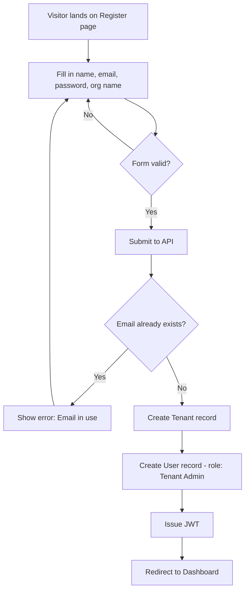
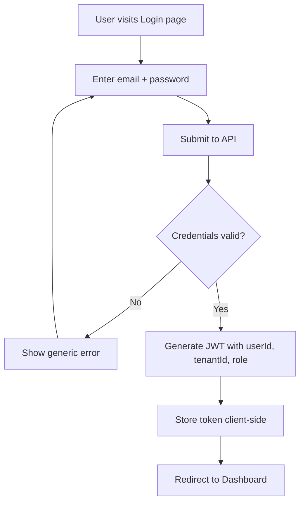
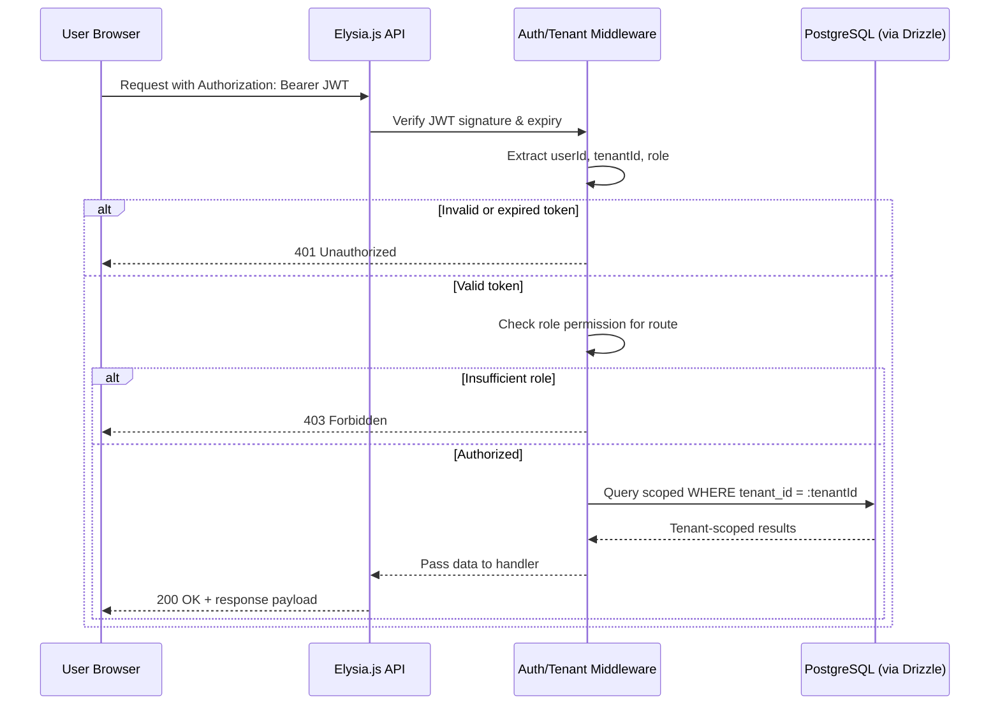
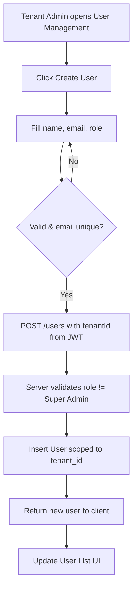
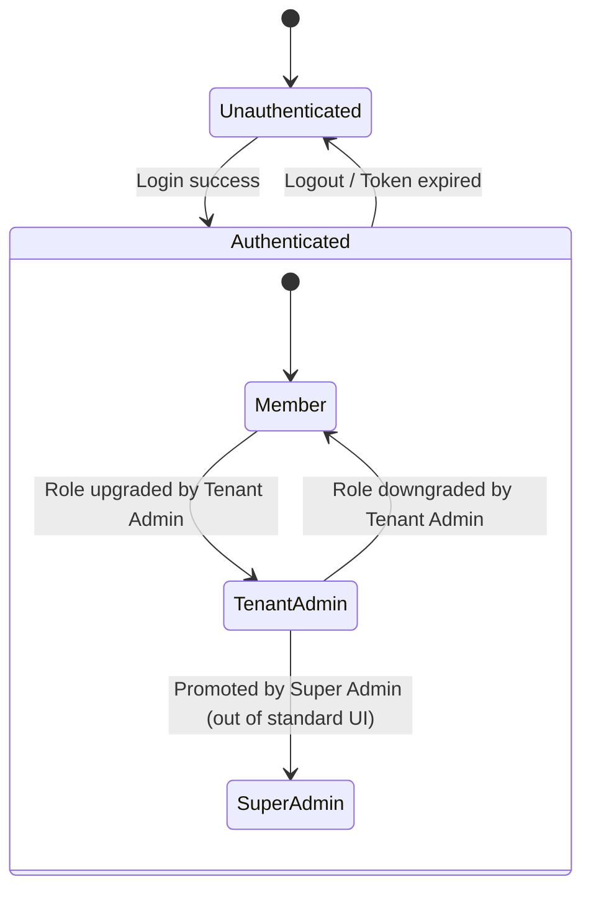
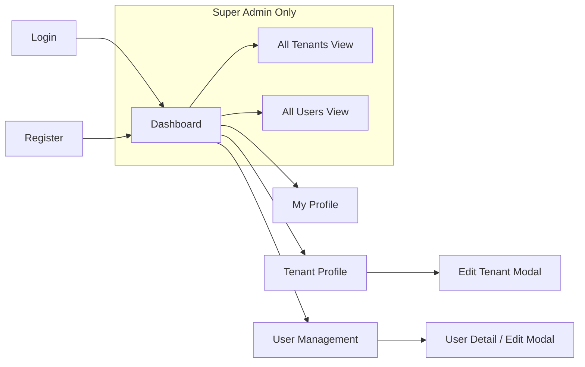
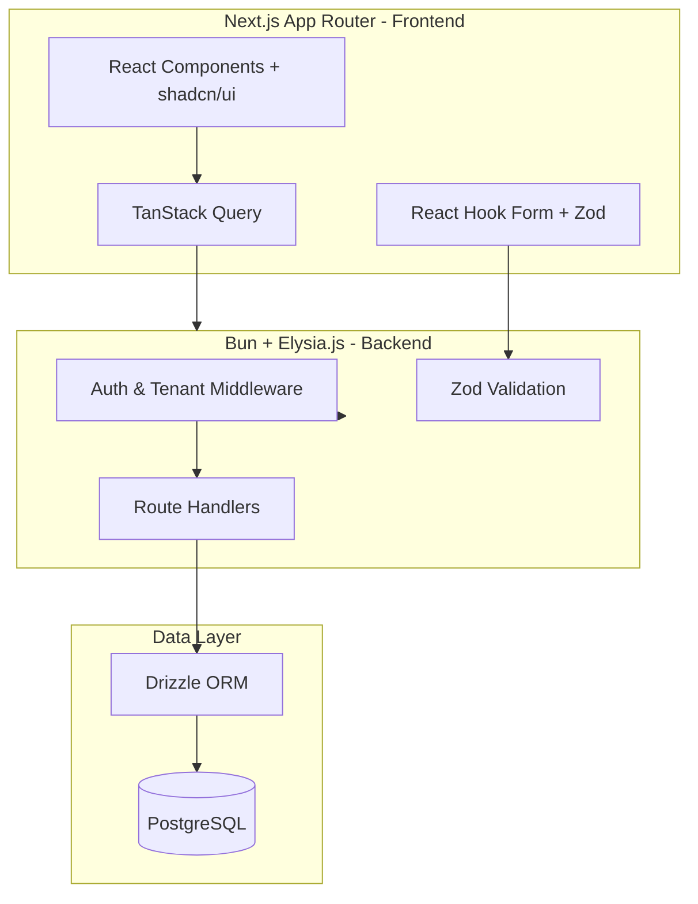
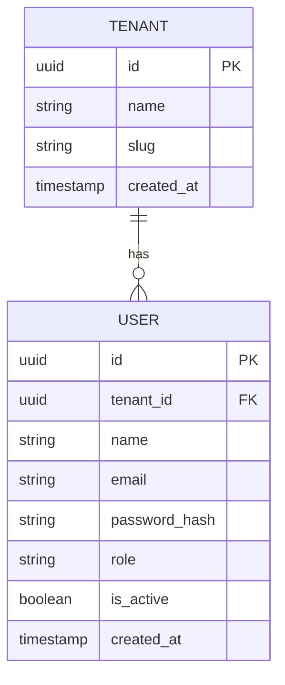

# Product Requirements Document (PRD)
## Multi-Tenant SaaS MVP

| | |
|---|---|
| **Document Type** | Product Requirements Document |
| **Product** | Multi-Tenant SaaS MVP |
| **Version** | 1.0 |
| **Status** | Draft — For Review |
| **Owner** | Product Management |
| **Last Updated** | July 2026 |
| **Audience** | Engineering, Design, QA, Stakeholders |

---

## Table of Contents

1. [Executive Summary](#1-executive-summary)
2. [Product Vision](#2-product-vision)
3. [Goals & Objectives](#3-goals--objectives)
4. [Problem Statement](#4-problem-statement)
5. [Target Users & User Roles](#5-target-users--user-roles)
6. [Technology Stack](#6-technology-stack)
7. [Functional Requirements](#7-functional-requirements)
8. [RBAC & Permission Matrix](#8-rbac--permission-matrix)
9. [Non-Functional Requirements](#9-non-functional-requirements)
10. [User Stories & Acceptance Criteria](#10-user-stories--acceptance-criteria)
11. [Business Rules](#11-business-rules)
12. [Feature Breakdown](#12-feature-breakdown)
13. [User Flows](#13-user-flows)
14. [Navigation Structure](#14-navigation-structure)
15. [System Architecture Overview](#15-system-architecture-overview)
16. [Edge Cases](#16-edge-cases)
17. [Risks & Assumptions](#17-risks--assumptions)
18. [Success Metrics](#18-success-metrics)
19. [Out of Scope](#19-out-of-scope)
20. [Future Roadmap](#20-future-roadmap)
21. [Glossary](#21-glossary)

---

## 1. Executive Summary

The **Multi-Tenant SaaS MVP** is a foundational platform that enables multiple independent organizations ("tenants") to securely register, manage users, and operate within a single shared application instance while maintaining strict data isolation between tenants.

This MVP establishes the core infrastructure — authentication, tenant management, role-based access control (RBAC), and user management — that nearly every B2B SaaS product requires before layering on domain-specific functionality. The goal is to ship a secure, scalable, and well-architected foundation using a modern, type-safe stack (Bun, Elysia.js, PostgreSQL, Drizzle ORM on the backend; Next.js App Router, TypeScript, and shadcn/ui on the frontend).

The MVP prioritizes **security correctness** (tenant isolation, JWT-based auth, RBAC enforcement), **developer velocity** (type-safe end-to-end stack), and **a clean, extensible data model** that later product features can build upon.

---

## 2. Product Vision

> To provide a secure, reliable, multi-tenant foundation that lets any organization onboard in minutes, manage their team with confidence, and trust that their data is never visible to another tenant.

The platform is designed as the **backbone layer** of a broader SaaS product suite — the MVP itself does not deliver a vertical-specific business feature, but rather the tenancy, identity, and access-control primitives that all future features depend on.

---

## 3. Goals & Objectives

| Goal | Objective | Measure |
|---|---|---|
| Secure multi-tenancy | Guarantee complete data isolation between tenants at the API and database query level | Zero cross-tenant data leakage incidents |
| Streamlined onboarding | Allow a new organization to register and start using the product in under 3 minutes | < 3 min average time-to-first-login |
| Robust access control | Enforce RBAC consistently across all protected resources | 100% of protected endpoints covered by role checks |
| Developer-friendly foundation | Ship a type-safe, well-documented codebase that supports rapid future feature development | Full type coverage frontend-to-backend via Zod + Drizzle |
| Operational visibility | Give admins a real-time snapshot of their organization via a dashboard | Dashboard data accuracy validated against DB source of truth |

---

## 4. Problem Statement

Organizations evaluating SaaS tools need confidence that:

1. Their data is **never accessible** to other customers sharing the same application infrastructure.
2. **Access within their own organization** is controlled — not every employee should have administrative rights.
3. Onboarding a new team should be **self-service**, not require manual provisioning by the vendor.

Most early-stage SaaS products either bolt on multi-tenancy after the fact (leading to security bugs and costly refactors) or over-engineer it prematurely (slowing time-to-market). This MVP solves both problems by building **tenant isolation and RBAC as first-class citizens from day one**, using a lean but production-grade architecture.

---

## 5. Target Users & User Roles

### 5.1 Target Users

| Persona | Description | Primary Needs |
|---|---|---|
| **Organization Owner / Tenant Admin** | Signs up the company, manages team and settings | Fast onboarding, user management, visibility into org activity |
| **Team Member** | Invited employee using the product day-to-day | Simple login, access to relevant features, self-service profile management |
| **Platform Operator (Super Admin)** | Internal staff operating the SaaS platform itself | Cross-tenant visibility, platform health, support tooling |

### 5.2 User Roles Overview

| Role | Scope | Description |
|---|---|---|
| **Super Admin** | Platform-wide (cross-tenant) | Internal role for platform operators; can view/manage all tenants and users across the system |
| **Tenant Admin** | Single tenant | Full administrative control within their own organization only |
| **Member** | Single tenant | Standard user with limited, self-service permissions within their own organization |

---

## 6. Technology Stack

### 6.1 Backend

| Layer | Technology | Purpose |
|---|---|---|
| Runtime | **Bun** | Fast JavaScript/TypeScript runtime |
| Framework | **Elysia.js** | Type-safe, high-performance web framework |
| Database | **PostgreSQL** | Relational data store with strong consistency guarantees |
| ORM | **Drizzle ORM** | Type-safe schema definitions and queries |
| Auth | **JWT (JSON Web Tokens)** | Stateless authentication and session handling |

### 6.2 Frontend

| Layer | Technology | Purpose |
|---|---|---|
| Framework | **Next.js (App Router)** | Server/client rendering, routing |
| Language | **TypeScript** | Type safety across the app |
| Styling | **Tailwind CSS** | Utility-first styling |
| Components | **shadcn/ui** | Accessible, composable UI primitives |
| Data Fetching | **TanStack Query** | Server-state caching and synchronization |
| Forms | **React Hook Form** | Performant form state management |
| Validation | **Zod** | Schema validation shared across client and server |

### 6.3 Stack Rationale

- **Bun + Elysia.js** provide a high-performance, low-latency API layer with native TypeScript support and minimal boilerplate.
- **Drizzle ORM** offers compile-time-safe SQL query building, reducing the risk of malformed or unscoped tenant queries.
- **Zod**, shared between frontend and backend, ensures a single source of truth for validation rules, reducing drift between client and server logic.
- **JWT** enables a stateless auth model well suited to horizontally scaled API deployments.

---

## 7. Functional Requirements

### 7.1 Multi-Tenancy

| ID | Requirement | Priority |
|---|---|---|
| MT-01 | System shall allow creation of a new organization (tenant) during registration | Must Have |
| MT-02 | Every database record belonging to tenant-scoped tables shall include a `tenant_id` foreign key | Must Have |
| MT-03 | Every API request (except public/auth endpoints) shall be scoped to the authenticated user's `tenant_id` | Must Have |
| MT-04 | No query shall be able to return data belonging to a different tenant, regardless of role, except Super Admin | Must Have |
| MT-05 | Tenant identification shall be derived from the JWT payload, never from client-supplied parameters | Must Have |

### 7.2 Authentication

| ID | Requirement | Priority |
|---|---|---|
| AUTH-01 | Users shall be able to register a new account, which creates both a User and a Tenant (for the first user) | Must Have |
| AUTH-02 | Users shall be able to log in with email and password | Must Have |
| AUTH-03 | Users shall be able to log out, invalidating their active session/token | Must Have |
| AUTH-04 | System shall issue a signed JWT access token upon successful login | Must Have |
| AUTH-05 | Protected routes (frontend) and protected endpoints (backend) shall reject requests without a valid JWT | Must Have |
| AUTH-06 | Passwords shall be hashed (e.g., bcrypt/argon2) before storage; plaintext passwords are never stored | Must Have |
| AUTH-07 | JWT shall include `userId`, `tenantId`, and `role` claims | Must Have |

### 7.3 RBAC

| ID | Requirement | Priority |
|---|---|---|
| RBAC-01 | System shall support three roles: Super Admin, Tenant Admin, Member | Must Have |
| RBAC-02 | Every protected endpoint shall enforce a minimum required role | Must Have |
| RBAC-03 | Frontend shall conditionally render UI elements based on the current user's role | Must Have |
| RBAC-04 | Attempting an unauthorized action shall return `403 Forbidden` with a clear error message | Must Have |

### 7.4 Tenant Management

| ID | Requirement | Priority |
|---|---|---|
| TEN-01 | Tenant Admin shall be able to update tenant profile (name, description, logo/branding fields) | Must Have |
| TEN-02 | Any authenticated user shall be able to view their tenant's profile (read-only for Members) | Must Have |
| TEN-03 | Super Admin shall be able to view all tenants on the platform | Must Have |
| TEN-04 | Tenant creation shall auto-generate a unique tenant slug/identifier | Should Have |

### 7.5 User Management

| ID | Requirement | Priority |
|---|---|---|
| USR-01 | Tenant Admin shall be able to view all users within their tenant | Must Have |
| USR-02 | Tenant Admin shall be able to create new users within their tenant | Must Have |
| USR-03 | Tenant Admin shall be able to edit user details (name, email, role) within their tenant | Must Have |
| USR-04 | Tenant Admin shall be able to delete/deactivate users within their tenant | Must Have |
| USR-05 | Tenant Admin shall be able to assign or change a user's role, excluding elevation to Super Admin | Must Have |
| USR-06 | Super Admin shall be able to view users across all tenants | Should Have |
| USR-07 | A user shall not be able to delete their own account via User Management (must use Profile flow, if enabled) | Should Have |

### 7.6 Dashboard

| ID | Requirement | Priority |
|---|---|---|
| DASH-01 | Dashboard shall display total number of users within the current tenant | Must Have |
| DASH-02 | Dashboard shall display total number of tenants (Super Admin view only) | Must Have |
| DASH-03 | Dashboard shall display current logged-in user's information (name, email, role) | Must Have |
| DASH-04 | Dashboard metrics shall reflect real-time or near-real-time data (max 5 min staleness) | Should Have |

### 7.7 Profile

| ID | Requirement | Priority |
|---|---|---|
| PROF-01 | User shall be able to view their own profile details | Must Have |
| PROF-02 | User shall be able to edit their own profile (name, email, password) | Must Have |
| PROF-03 | Users shall not be able to edit their own role from the Profile page | Must Have |

---

## 8. RBAC & Permission Matrix

### 8.1 Role Definitions

| Role | Description |
|---|---|
| **Super Admin** | Full platform access. Not tied to a single tenant. Used by internal platform operators. |
| **Tenant Admin** | Full administrative rights within their own tenant only. Typically the org creator or delegated admin. |
| **Member** | Standard end user within a tenant. Self-service access only. |

### 8.2 Detailed Permission Matrix

| Capability | Super Admin | Tenant Admin | Member |
|---|:---:|:---:|:---:|
| Register new tenant | ✅ | ✅ (self-service signup) | ❌ |
| View own tenant profile | ✅ | ✅ | ✅ |
| Update own tenant profile | ✅ | ✅ | ❌ |
| View all tenants (platform-wide) | ✅ | ❌ | ❌ |
| View users in own tenant | ✅ | ✅ | ❌ |
| View users across all tenants | ✅ | ❌ | ❌ |
| Create user in own tenant | ✅ | ✅ | ❌ |
| Edit user in own tenant | ✅ | ✅ | ❌ |
| Delete user in own tenant | ✅ | ✅ | ❌ |
| Assign role to a user (Member ↔ Tenant Admin) | ✅ | ✅ | ❌ |
| Assign/revoke Super Admin role | ✅ | ❌ | ❌ |
| View own profile | ✅ | ✅ | ✅ |
| Edit own profile | ✅ | ✅ | ✅ |
| View dashboard (tenant-level metrics) | ✅ | ✅ | ✅ (limited) |
| View dashboard (platform-level metrics) | ✅ | ❌ | ❌ |
| Access another tenant's data | ✅ | ❌ | ❌ |

**Legend:** ✅ = Permitted · ❌ = Not Permitted

### 8.3 Enforcement Notes

- Role and tenant checks must be enforced **server-side** on every request; frontend role-based UI hiding is a UX convenience only, not a security boundary.
- Middleware shall extract `tenantId` and `role` from the verified JWT and attach them to the request context before any handler logic executes.
- Any endpoint lacking an explicit role check shall default to **most restrictive** (Tenant Admin or higher) rather than defaulting to open access.

---

## 9. Non-Functional Requirements

| Category | Requirement |
|---|---|
| **Security** | All passwords hashed with a strong algorithm (bcrypt/argon2); JWTs signed with a strong secret/key and short expiry with refresh strategy |
| **Security** | All tenant-scoped queries must filter by `tenant_id` at the ORM/query layer; no reliance on application-layer filtering alone |
| **Performance** | API endpoints should respond within 300ms (p95) under normal load |
| **Scalability** | Architecture should support horizontal scaling of the Elysia.js API layer (stateless JWT auth supports this) |
| **Availability** | Target 99.5% uptime for MVP phase |
| **Data Integrity** | Foreign key constraints enforced at the database level between `users`, `tenants`, and `roles` |
| **Auditability** | Key actions (user creation, role changes, deletions) should be loggable for future audit trail features |
| **Usability** | UI must be responsive (mobile, tablet, desktop) and accessible (WCAG 2.1 AA target) |
| **Maintainability** | Shared Zod schemas between frontend and backend to avoid validation drift |
| **Portability** | Backend containerizable (Docker-ready) for consistent deployment across environments |
| **Compliance** | Passwords and JWT secrets never logged or exposed in error messages/responses |

---

## 10. User Stories & Acceptance Criteria

### 10.1 Authentication

**US-01: Registration**
> As a new organization owner, I want to register an account and create my organization, so that my team can start using the platform.

**Acceptance Criteria:**
- Given valid email, password, and organization name, when I submit the registration form, then a new Tenant and a new User (role: Tenant Admin) are created.
- Given an email that already exists, when I submit registration, then I receive a clear validation error and no duplicate account is created.
- Given a weak password (below policy), when I submit registration, then I receive a validation error specifying the requirement.

**US-02: Login**
> As a registered user, I want to log in with my email and password, so that I can access my organization's workspace.

**Acceptance Criteria:**
- Given correct credentials, when I submit the login form, then I receive a valid JWT and am redirected to the Dashboard.
- Given incorrect credentials, when I submit the login form, then I receive a generic "invalid credentials" error (no indication of which field is wrong).
- Given 5 consecutive failed attempts, when I try again, then the system applies rate limiting (Should Have).

**US-03: Logout**
> As a logged-in user, I want to log out, so that my session is securely ended on this device.

**Acceptance Criteria:**
- Given I am logged in, when I click "Log out," then my token is cleared client-side and I am redirected to the login page.
- Given I am logged out, when I try to access a protected route, then I am redirected to login.

### 10.2 Tenant Management

**US-04: View Tenant Profile**
> As any authenticated user, I want to view my organization's profile, so that I understand which org I belong to.

**Acceptance Criteria:**
- Given I am authenticated, when I navigate to the Tenant Profile page, then I see my tenant's name, slug, and metadata.
- Given I am a Member, when I view the Tenant Profile page, then edit controls are not visible/enabled.

**US-05: Update Tenant Profile**
> As a Tenant Admin, I want to update my organization's details, so that our profile stays accurate.

**Acceptance Criteria:**
- Given I am a Tenant Admin, when I update the tenant name and save, then the change is persisted and reflected immediately.
- Given I am a Member, when I attempt to call the update-tenant API directly, then I receive a 403 Forbidden response.

### 10.3 User Management

**US-06: Create User**
> As a Tenant Admin, I want to add a new user to my organization, so that my team member can access the platform.

**Acceptance Criteria:**
- Given valid name, email, and role, when I submit the "create user" form, then a new user is created scoped to my tenant.
- Given an email already used within any tenant, when I submit, then I receive a validation error.
- Given I attempt to assign the "Super Admin" role, when I submit, then the role is rejected/unavailable in the UI.

**US-07: Edit / Delete User**
> As a Tenant Admin, I want to edit or remove users in my organization, so that our team roster stays accurate.

**Acceptance Criteria:**
- Given an existing user in my tenant, when I edit their name/role and save, then the changes persist.
- Given an existing user in my tenant, when I delete them, then they can no longer log in and are removed from user lists.
- Given a user belonging to a different tenant, when I attempt to edit/delete via API, then I receive a 403/404 response.

### 10.4 Dashboard & Profile

**US-08: View Dashboard**
> As a logged-in user, I want to see key metrics about my organization, so that I have visibility into our usage.

**Acceptance Criteria:**
- Given I am any authenticated user, when I load the dashboard, then I see total users in my tenant and my own user info.
- Given I am a Super Admin, when I load the dashboard, then I additionally see total tenant count platform-wide.

**US-09: Edit Profile**
> As a logged-in user, I want to update my own name, email, and password, so that my account information stays current.

**Acceptance Criteria:**
- Given valid new profile data, when I save, then my profile updates and a success confirmation is shown.
- Given I try to change my role via the profile form, then the request is rejected (role change not permitted from this flow).

---

## 11. Business Rules

| ID | Rule |
|---|---|
| BR-01 | A user belongs to exactly one tenant. Cross-tenant user membership is not supported in the MVP. |
| BR-02 | The first user to register for a new tenant is automatically assigned the **Tenant Admin** role. |
| BR-03 | A tenant must always have at least one active Tenant Admin; the system shall prevent removing/demoting the last remaining Tenant Admin. |
| BR-04 | Email addresses must be unique platform-wide (not just per-tenant), to prevent login ambiguity. |
| BR-05 | Only a Super Admin may create or promote another Super Admin; this cannot be done via standard User Management UI. |
| BR-06 | JWT tokens expire after a configured interval (e.g., 15–60 minutes) and require refresh or re-login. |
| BR-07 | Deleted users are soft-deleted (flagged inactive) rather than hard-deleted, to preserve referential integrity and audit history. |
| BR-08 | All timestamps are stored in UTC; display is localized on the frontend. |

---

## 12. Feature Breakdown

| Feature Area | Included in MVP | Key Screens |
|---|---|---|
| Multi-Tenant Core | ✅ | N/A (backend/architecture) |
| Authentication | ✅ | Register, Login |
| RBAC | ✅ | N/A (enforced across all screens) |
| Tenant Management | ✅ | Tenant Profile (View/Edit) |
| User Management | ✅ | User List, Create/Edit User Modal |
| Dashboard | ✅ | Dashboard Home |
| Profile | ✅ | My Profile (View/Edit) |

---

## 13. User Flows

### 13.1 Registration & Tenant Creation Flow

### 13.2 Login Flow

### 13.3 Authenticated Request / Tenant Scoping Sequence

### 13.4 User Management Flow (Tenant Admin creates a user)

### 13.5 Role & Access State Diagram

---

## 14. Navigation Structure

### 14.1 Route-Level Access Table

| Route | Public | Member | Tenant Admin | Super Admin |
|---|:---:|:---:|:---:|:---:|
| `/register` | ✅ | – | – | – |
| `/login` | ✅ | – | – | – |
| `/dashboard` | ❌ | ✅ | ✅ | ✅ |
| `/tenant` (profile view) | ❌ | ✅ | ✅ | ✅ |
| `/tenant/edit` | ❌ | ❌ | ✅ | ✅ |
| `/users` | ❌ | ❌ | ✅ | ✅ |
| `/users/:id` (edit) | ❌ | ❌ | ✅ | ✅ |
| `/profile` | ❌ | ✅ | ✅ | ✅ |
| `/admin/tenants` | ❌ | ❌ | ❌ | ✅ |
| `/admin/users` | ❌ | ❌ | ❌ | ✅ |

---

## 15. System Architecture Overview

### 15.1 Core Data Model (Simplified)

---

## 16. Edge Cases

| # | Scenario | Expected Behavior |
|---|---|---|
| 1 | User attempts to register with an email that exists in another tenant | Registration blocked; email uniqueness is platform-wide |
| 2 | Tenant Admin tries to delete themselves while being the only admin | Action blocked with explanatory error (BR-03) |
| 3 | JWT is tampered with or expired | Request rejected with 401; user redirected to login on frontend |
| 4 | Tenant Admin attempts to view/edit a user belonging to another tenant (via direct API call/ID guessing) | 403/404 response; no data leakage even in error messages |
| 5 | Member attempts to access `/users` route directly via URL | Redirected/blocked by route guard; API also enforces 403 |
| 6 | Two users attempt to register the same organization name simultaneously | Unique slug generation resolves collision (e.g., append suffix) |
| 7 | Dashboard requested for a tenant with zero users besides the requester | Displays accurate count (1), no errors |
| 8 | Super Admin views All Tenants while a tenant has zero users | Tenant listed with 0 users, not omitted |
| 9 | User's role is changed while they have an active session | Role change takes effect on next token refresh/re-login; document this latency clearly to admins |
| 10 | Concurrent edits to the same user record by two admins | Last-write-wins for MVP; optimistic concurrency noted as future improvement |
| 11 | Password field submitted empty on Profile edit | Password unchanged; only non-empty fields are updated |
| 12 | Deleted (soft-deleted) user attempts to log in | Login rejected as if credentials invalid |

---

## 17. Risks & Assumptions

### 17.1 Risks

| Risk | Impact | Likelihood | Mitigation |
|---|---|---|---|
| Improper tenant scoping in a query leads to data leakage | Critical | Medium | Centralize tenant-scoping logic in shared query helpers; mandatory code review checklist; automated tests per tenant-scoped endpoint |
| JWT secret leakage or weak signing | Critical | Low | Store secrets in environment/secret manager; rotate periodically |
| Role-check omitted on a new endpoint | High | Medium | Default-deny middleware pattern; RBAC enforced centrally, not per-handler ad hoc |
| Email uniqueness constraint causes poor UX (user unaware their email is taken by another org) | Medium | Medium | Clear, privacy-conscious error messaging (no company name leakage) |
| Bun/Elysia.js ecosystem maturity (fewer libraries vs. Node/Express) | Medium | Medium | Evaluate library support early; fallback plans for critical integrations |

### 17.2 Assumptions

- Each user belongs to exactly one tenant for the MVP (no multi-tenant membership).
- Email/password is the only authentication method for MVP (no SSO/OAuth yet).
- Deployment environment supports Bun runtime (containerized via Docker).
- Single-region PostgreSQL deployment is sufficient for MVP scale.
- Internal Super Admin accounts are provisioned manually/out-of-band, not via public registration.

---

## 18. Success Metrics

| Metric | Target (MVP Launch + 90 Days) |
|---|---|
| Tenant registration completion rate | ≥ 90% of started registrations completed |
| Time-to-first-login after registration | < 3 minutes average |
| Cross-tenant data leakage incidents | 0 |
| API error rate (5xx) | < 0.5% of requests |
| Average API response time (p95) | < 300ms |
| RBAC-related support tickets (unauthorized access confusion) | < 5% of total support volume |
| Dashboard load time | < 1.5 seconds |
| User management task completion rate (create/edit/delete without error) | ≥ 95% |

---

## 19. Out of Scope

The following are explicitly **not** included in this MVP and are candidates for future phases:

- Single Sign-On (SSO) / OAuth / SAML integration
- Multi-factor authentication (MFA)
- Billing, subscriptions, and payment processing
- Granular, custom/configurable role permissions (beyond the 3 fixed roles)
- Team/department sub-groupings within a tenant
- Audit log UI (logging infrastructure may exist, but no dedicated UI)
- Email notification system (invites, password reset emails)
- Password reset / "forgot password" flow
- File/document storage features
- API rate limiting dashboards / advanced abuse protection
- Internationalization (i18n) / multi-language support
- Real-time collaboration features (WebSockets, live presence)
- Mobile native applications

---

## 20. Future Roadmap

| Phase | Theme | Example Features |
|---|---|---|
| **Phase 2** | Account Recovery & Security | Forgot password, email verification, MFA |
| **Phase 2** | Notifications | Email invites for new users, in-app notifications |
| **Phase 3** | Advanced RBAC | Custom roles, granular permission editor, resource-level permissions |
| **Phase 3** | Billing | Subscription plans, usage-based billing, Stripe integration |
| **Phase 4** | Enterprise Readiness | SSO/SAML, audit logs UI, IP allow-listing, data export |
| **Phase 4** | Collaboration | Sub-teams/departments, activity feed, real-time presence |
| **Phase 5** | Platform Scale | Multi-region deployment, read replicas, caching layer (Redis) |

---

## 21. Glossary

| Term | Definition |
|---|---|
| **Tenant** | An organization/customer account within the platform; the primary unit of data isolation |
| **Multi-Tenancy** | An architecture where a single application instance serves multiple isolated tenants |
| **Tenant Isolation** | Guarantee that one tenant cannot access another tenant's data |
| **RBAC** | Role-Based Access Control; restricting system access based on a user's assigned role |
| **JWT** | JSON Web Token; a signed, stateless token used to authenticate API requests |
| **Super Admin** | Platform-level role with cross-tenant access, used by internal operators |
| **Tenant Admin** | Highest-privilege role within a single tenant |
| **Member** | Standard, limited-privilege role within a single tenant |
| **Soft Delete** | Marking a record inactive rather than physically removing it from the database |
| **Drizzle ORM** | A TypeScript-first ORM used for type-safe database schema and queries |
| **Elysia.js** | A TypeScript web framework optimized for the Bun runtime |
| **p95** | The 95th percentile value of a measured metric (e.g., response time), used as a performance benchmark |

---

*End of Document*