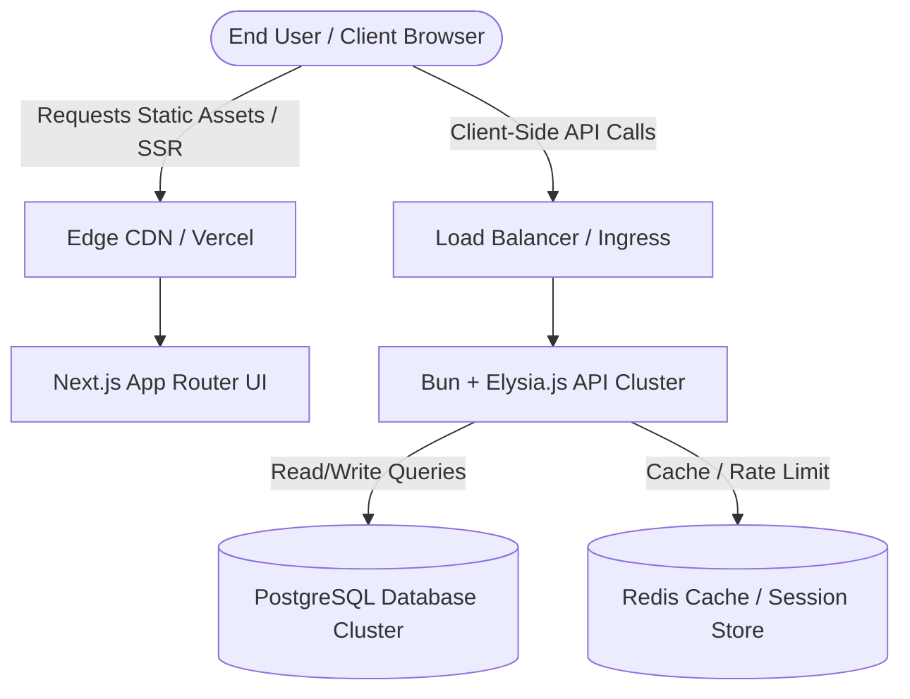
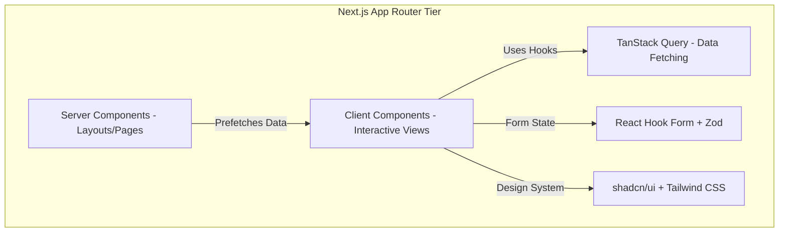
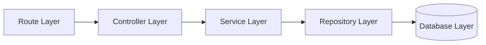
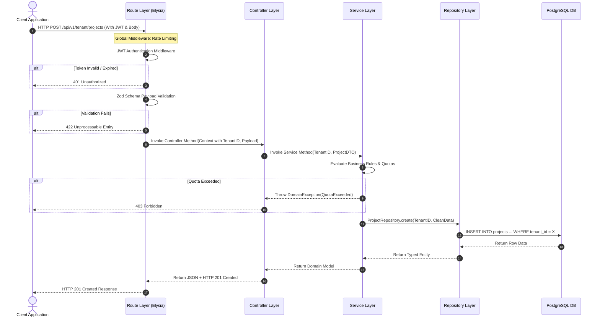
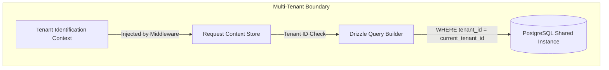
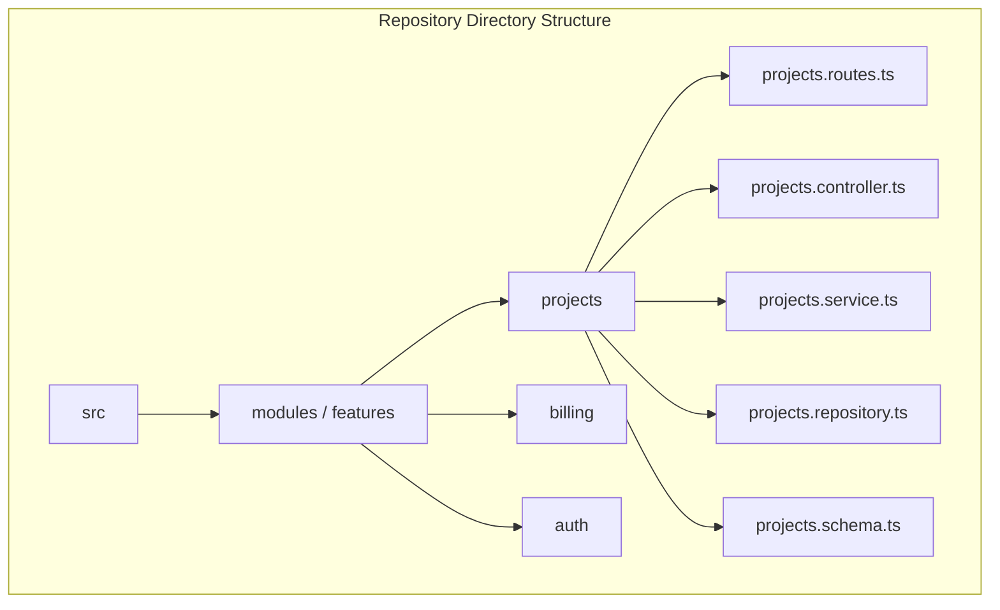
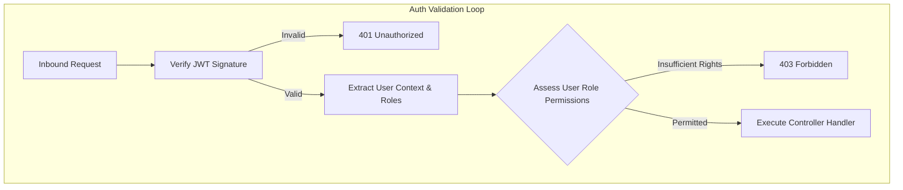
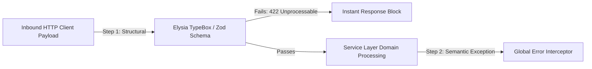
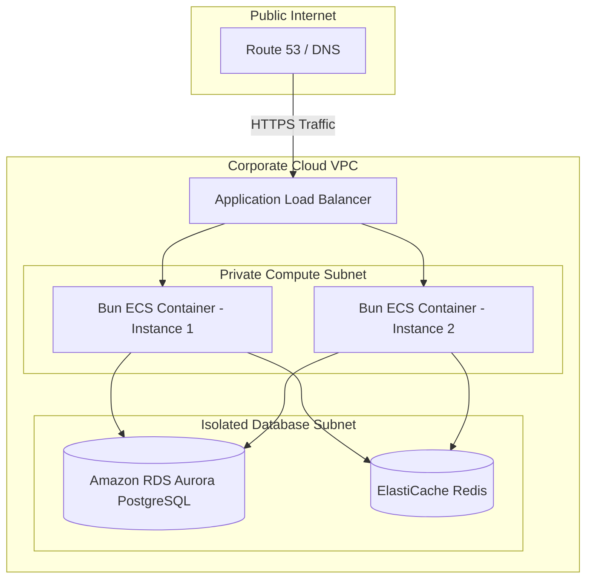

# System Architecture Document

## Project: Multi-Tenant SaaS MVP

**Document Version:** 1.0.0  
**Date:** July 2026  
**Author:** Senior Software Architect  
**Target Audience:** Developers, Architects, QA Engineers, Stakeholders

---

## 1. Executive Summary & Design Principles

### 1.1 Purpose

This document provides a comprehensive technical blueprint for a production-ready, highly scalable, and maintainable Multi-Tenant Software-as-a-Service (SaaS) Minimum Viable Product (MVP). It establishes the architectural patterns, structural design, and data-flow standards necessary to ensure security, high performance, and rapid feature velocity.

### 1.2 Core Design Principles

To support a robust SaaS product, the architecture adheres to the following foundational principles:

- **Separation of Concerns (SoC):** Each component has a singular, clearly defined responsibility, minimizing ripple effects when code changes.
- **Maintainability & Readability:** Code organization is highly predictable, self-documenting, and standardized across both frontend and backend.
- **Scalability:** Horizontal scaling capabilities are baked into the stateless compute layers, while data partitioning strategies allow the persistence layer to expand.
- **Testability:** By heavily decoupling layers using clear boundaries and structural patterns, unit testing, integration testing, and mocking become straightforward.
- **Security by Default:** Multi-tenant isolation, structured input validation, rigorous authorization barriers, and token management are enforced at the architectural foundation.

---

## 2. High-Level System Architecture

The system utilizes a modern, performance-optimized, decentralized topology. It relies on a decoupled Client-Server architecture where a Next.js single-page application interacts with an ultra-fast Bun + Elysia.js edge-ready RESTful API.



### 2.1 Core Infrastructure Components

| Component                 | Technology           | Primary Role                                                                                               |
| :------------------------ | :------------------- | :--------------------------------------------------------------------------------------------------------- |
| **Frontend Hosting**      | Vercel / Edge CDN    | Delivers static assets, performs Server-Side Rendering (SSR), and executes edge routing optimization.      |
| **Frontend UI Framework** | Next.js (App Router) | Handles application routing, page layouts, client-side state, and UI view rendering.                       |
| **Load Balancing**        | AWS ALB / Nginx      | Terminates SSL, manages traffic routing, and distributes load across backend API clusters.                 |
| **Application Runtime**   | Bun                  | High-performance, all-in-one JavaScript/TypeScript runtime executing code with minimal cold start latency. |
| **API Framework**         | Elysia.js            | Lightweight, type-safe, ultra-fast web framework optimized for Bun.                                        |
| **Database Tier**         | PostgreSQL           | Relational database engine responsible for robust transaction handling and data persistence.               |
| **ORM / Data Access**     | Drizzle ORM          | Type-safe TypeScript Object-Relational Mapper executing optimal SQL statements.                            |

---

## 3. Frontend Architecture

The frontend leverages Next.js App Router to blend server-side composition with rich, highly interactive client-side components.



### 3.1 Technical Stack Breakdown

- **Next.js (App Router):** Facilitates static site generation (SSG), server-side rendering (SSR), and progressive hydration. Server Components handle initial security headers and server-to-server API prefetching, reducing Client-Side JavaScript bundles.
- **TypeScript:** Enforces strict compile-time type-safety across layouts, components, and hooks.
- **Tailwind CSS & shadcn/ui:** Uses atomic, utility-first CSS utility classes combined with accessible, unstyled, headless radix-primitives. This ensures highly customizable, consistent, responsive components without runtime style overhead.
- **TanStack Query (React Query):** Manages asynchronous server state, declarative caching, automatic re-fetching, deduplication of requests, and mutations.
- **React Hook Form & Zod:** Orchestrates performant, uncontrolled form state management coupled with schema-driven, runtime user input validation.

---

## 4. Backend & Layered Architecture

The backend application is designed as a strict **Layered N-Tier Architecture**. No layer may bypass its immediate subordinate layer to access data or invoke operations, ensuring predictability and clean cross-cutting execution.



### 4.1 Layer Responsibilities and Workflow

#### 1. Route Layer (Elysia.js Router)

- **Responsibility:** Defines HTTP verbs, paths, and endpoint bindings. Enforces URI-level middleware execution.
- **Data Input:** Raw HTTP Request (Headers, URL Parameters, Query Strings, JSON Body).
- **Operations:** Resolves incoming URLs, attaches global plugins, executes primitive structural validations, and maps inputs to designated controllers.
- **Data Output:** Routes unpacked parameters cleanly into the Controller.

#### 2. Controller Layer

- **Responsibility:** Orchestrates HTTP-specific semantics. Maps transport-agnostic inputs to application logic and standardizes transport-specific responses.
- **Data Input:** Sanitized parameters or plain JavaScript objects provided by the Route Layer.
- **Operations:** Extracts tenant identifiers from request contexts, validates request payloads against strict definitions, catches errors to return standard HTTP status codes, and manages HTTP cookies or custom header assignments.
- **Data Output:** Returns standard JavaScript Object Notation (JSON) payloads to the Route Layer or invokes the Service Layer with typed domain entities.

#### 3. Service Layer (The Domain Logic Core)

- **Responsibility:** Encapsulates the core business logic, application policies, workflow validation, and transactional use cases. This layer remains totally decoupled from HTTP frameworks or specific database query languages.
- **Data Input:** Native TypeScript interfaces, Primitive parameters, or Domain Transfer Objects (DTOs).
- **Operations:** Evaluates business rules, triggers domain calculations, coordinates complex multi-entity workflows, runs cross-resource validation, and manages multi-repository transactions.
- **Data Output:** Domain Models, Domain Records, or structured data payload collections.

#### 4. Repository Layer (Data Access Layer)

- **Responsibility:** Acts as an abstraction over the data persistence mechanisms. Translates domain request semantics into raw SQL or ORM expressions.
- **Data Input:** Query parameters, Domain filter specifications, or raw values to persist.
- **Operations:** Executes SELECT, INSERT, UPDATE, and DELETE operations via Drizzle ORM. Enforces automated tenant isolation scopes via explicit SQL `WHERE` criteria injection.
- **Data Output:** Type-safe database records mapped directly to TypeScript objects via Drizzle schema mapping.

#### 5. Database Layer

- **Responsibility:** ACID-compliant data persistence, indexing, data integrity via constraints, and physical storage.

---

## 5. Request Lifecycle & Data Flow

The lifecycle of an inbound request outlines the deterministic validation, authentication, execution, and response sequence across the backend architecture.



---

## 6. Multi-Tenant Architecture & Tenant Isolation

This MVP uses a **Shared Database, Shared Schema (Discriminator Column)** strategy. It guarantees high cost-efficiency, low infrastructure complexity, and straightforward maintainability for an early-stage SaaS application, while strictly preventing cross-tenant data leaks via structural patterns.



### 6.1 Multi-Tenant Governance Mechanisms

1.  **Identification:** Every inbound request must provide a tenant context. This is typically embedded inside a secure JWT claim (e.g., `tenantId`) or extracted from an organization slug present in custom routing subdomains.
2.  **Context Injection:** An Elysia.js scoping plugin intercepts requests, unpacks the tenant identifier, and mounts it into the local Request Context object (`ctx.tenantId`).
3.  **Repository Isolation Enforcement:** Raw queries are prohibited. All data access must pass through the Repository Layer. The repository methods enforce a non-nullable `tenantId` parameter, dynamically appending a strict SQL condition:
    ```typescript
    // Architecture standard representation
    await db.select().from(projects).where(eq(projects.tenantId, tenantId));
    ```

### 6.2 Comparison of Isolation Strategies

| Strategy                   | Operational Cost | Infrastructure Complexity | Isolation Strength   | MVP Suitability        |
| :------------------------- | :--------------- | :------------------------ | :------------------- | :--------------------- |
| **Database-per-Tenant**    | Extremely High   | Very High                 | Maximum              | Low (Over-engineered)  |
| **Schema-per-Tenant**      | High             | High                      | Strong               | Medium                 |
| **Shared Schema (Column)** | **Very Low**     | **Minimal**               | **Logical Enforced** | **Highest (Selected)** |

---

## 7. Module & Feature Structure

The codebases conform to a **Module/Feature-First** structure rather than a purely technical-layered layout. This allows files belonging to the same business capability to live closely together, increasing developer onboarding velocity and avoiding continuous global directory switching.



### 7.1 Backend Directory Layout Reference

```text
src/
├── config/                  # Global system configuration environment blueprints
├── db/                      # Core migration configuration and DB client initialization
│   ├── index.ts             # Drizzle instance connection setup
│   └── schema.ts            # Global schema imports aggregator
├── middleware/              # Cross-cutting HTTP middleware (CORS, Rate Limiting)
├── modules/                 # Feature-first application modules
│   ├── auth/                # Authentication & User onboarding logic
│   ├── tenant/              # Organization management & onboarding
│   └── projects/            # Sample business domain feature folder
│       ├── projects.routes.ts     # Endpoint bindings and input mapping
│       ├── projects.controller.ts # Transport layer handling
│       ├── projects.service.ts    # Pure business rules execution
│       ├── projects.repository.ts # Database operations via Drizzle
│       └── projects.schema.ts     # Table definitions & validation contracts
└── index.ts                 # Application entrypoint & Elysia bootstrap
```

### 7.2 Frontend Directory Layout Reference

```text
src/
├── app/                     # Next.js App Router root folder
│   ├── (auth)/              # Route group for authentication flows
│   ├── (dashboard)/         # Route group for post-login tenant space
│   │   └── [tenantSlug]/    # Dynamic multi-tenant path routing
│   ├── api/                 # Next.js local route handlers
│   └── page.tsx             # Universal public landing component
├── components/              # Shared UI Design System items
│   ├── ui/                  # Raw shadcn/ui components
│   └── common/              # Reusable complex components
├── hooks/                   # Client state, fetching, and cross-cutting hooks
├── lib/                     # Global client instances (TanStack Query client, API client)
└── modules/                 # Feature-isolated layout components
    ├── projects/            # Project feature frontend elements
    │   ├── components/      # Feature UI elements
    │   ├── hooks.ts         # Queries & mutations specific to projects
    │   └── types.ts         # TypeScript structures for project models
    └── billing/             # Billing management frontend elements
```

---

## 8. Authentication & Authorization Architecture

Access control uses highly resilient, stateless token verification strategies split into explicit authentication (Identity confirmation) and authorization (Privilege verification) processing pipelines.



### 8.1 RBAC (Role-Based Access Control) Model

The SaaS platform implements a structured, predictable RBAC model out of the box to enforce operational guardrails inside individual tenant groups:

| Assigned Role | System Permissions                                                                                 | Scope of Action |
| :------------ | :------------------------------------------------------------------------------------------------- | :-------------- |
| **Owner**     | Full administrative rights, workspace deletion, billing lifecycle adjustments, member invitations. | Account Wide    |
| **Admin**     | Read and Write access to feature entities, configuration overrides, member management.             | Tenant Isolated |
| **Member**    | Read and Write access to standard business resources, cannot modify tenant settings.               | Tenant Isolated |
| **Viewer**    | Read-Only visibility across authorized workspace boards. No state modification allowed.            | Tenant Isolated |

---

## 9. Validation & Error Handling Strategy

### 9.1 Validation Flow

Validation is split into two lines of defense: structural/syntactic evaluation at the system perimeter, followed by semantic/business-rule verification inside the core domain.



1.  **Structural Validation (Edge):** Executed inside the Route layer using Elysia's high-speed inline TypeBox validation compilation or external Zod integration. Checks data types, formats, lengths, and field inclusions. Malformed elements are dropped before triggering any compute memory blocks.
2.  **Semantic Validation (Domain):** Performed inside the Service layer. Evaluates state permissions, double-entry alignment, system resource quotas, or logic constraints.

### 9.2 Error Classification Matrix

The platform normalizes error handling across layers to prevent sensitive internal telemetry data from spilling to the public internet while guaranteeing rich context debugging for engineers.

| Error Class           | Originating Layer    | Handled By             | HTTP Status                 | Client Response Payload                                                   |
| :-------------------- | :------------------- | :--------------------- | :-------------------------- | :------------------------------------------------------------------------ |
| `ValidationError`     | Route / Controller   | Framework Validator    | `422 Unprocessable Entity`  | `{ status: "error", message: "Validation failed", details: [...] }`       |
| `AuthenticationError` | Middleware           | Global Handler Plugin  | `401 Unauthorized`          | `{ status: "error", message: "Missing or invalid authentication token" }` |
| `ForbiddenError`      | Middleware / Service | Global Handler Plugin  | `403 Forbidden`             | `{ status: "error", message: "Insufficient privileges for resource" }`    |
| `EntityNotFoundError` | Repository / Service | Controller Try-Catch   | `404 Not Found`             | `{ status: "error", message: "Requested resource does not exist" }`       |
| `ConflictError`       | Service / Database   | Controller Try-Catch   | `409 Conflict`              | `{ status: "error", message: "Resource state conflict detected" }`        |
| `InternalServerError` | Any Uncaught Layer   | Central Error Boundary | `500 Internal Server Error` | `{ status: "error", message: "An unexpected system error occurred" }`     |

---

## 10. Logging & Observability

Observability relies on structured, JSON-formatted telemetry generation. System metrics output directly to standard stdout stream pipes to accommodate stateless container configurations.

```text
[Inbound Event] ──> [Pino / Winston Logger Module] ──> [JSON Payload String Output] ──> [CloudWatch / Logtail Log Aggregator]
```

### 10.1 Structured Log Blueprint Example

```json
{
  "timestamp": "2026-07-11T11:15:32.412Z",
  "level": "error",
  "traceId": "req-884bf92a-b73a-4da2",
  "tenantId": "tnnt-prod-09382",
  "userId": "usr-01389",
  "context": "ProjectService.createProject",
  "message": "Resource quota allocation exceeded for plan selection",
  "error": {
    "name": "QuotaExceededException",
    "details": "Current plan allows maximum 10 projects. Attempted creation of 11th project."
  }
}
```

---

## 11. Deployment & Infrastructure Architecture

The SaaS environment is deployed to cloud infrastructure using stateless containers running within an isolated Virtual Private Cloud (VPC).



## 12. Security Architecture

The platform embeds comprehensive application and data protection guardrails throughout every operational layer.

- **Transport Layer Protection:** Absolute HTTPS encryption transit utilizing strong TLS 1.3 protocol standards.
- **Cross-Origin Resource Sharing (CORS):** Strict explicit origin domain white-listing parameters. Open wildcard declarations are prohibited.
- **Database Access Minimization:** Plain SQL string generation is blocked in favor of parameterization and structural parsing native to Drizzle ORM, rendering SQL Injection vectors toothless.
- **Rate Limiting Overrides:** Edge API paths apply distinct sliding-window block criteria (e.g., maximum 100 API requests per rolling 60-second window per client IP identity).

---

## 13. System Assumptions and Limitation

### 13.1 Architectural Assumptions

- **Tenant Scale:** The target organization metrics match typical early-stage MVP curves (under 500 active organizations, with fewer than 50 concurrent active platform operators per tenant workspace).
- **Compute Topology:** The backend runtime cluster can run state-free, utilizing distributed caching clusters for tracking temporary operational data.

### 13.2 System Limitations

- **Data Isolation Bounds:** Because the system shares a common data storage instance and shared table structures, an indexing failure or code regression within the query logic could present logical leaks. Strict unit testing of the repository layer is vital.
- **Analytical Processing Overhead:** Large aggregate lookups or complex analytical tracking requests will impact the transaction handling speeds of the main database instance.
