# UI/UX Flow Document
## Multi-Tenant SaaS MVP

| | |
|---|---|
| **Document Type** | UI/UX Flow Document |
| **Product** | Multi-Tenant SaaS MVP |
| **Version** | 1.0 |
| **Status** | Draft — For Review |
| **Owner** | UX Architecture / Product Design |
| **Last Updated** | July 2026 |
| **Audience** | Designers, Frontend Engineers, QA, Stakeholders |
| **Scope Note** | This document focuses on user experience and interaction design. No UI code, API contracts, or database design are included. |

---

## Table of Contents

1. [User Personas](#1-user-personas)
2. [Information Architecture](#2-information-architecture)
3. [Application Navigation & Sitemap](#3-application-navigation--sitemap)
4. [Screen Inventory](#4-screen-inventory)
5. [Page Hierarchy](#5-page-hierarchy)
6. [Authentication Flow](#6-authentication-flow)
7. [Tenant Creation Flow](#7-tenant-creation-flow)
8. [Dashboard Flow](#8-dashboard-flow)
9. [Tenant Management Flow](#9-tenant-management-flow)
10. [User Management Flow](#10-user-management-flow)
11. [Profile Management Flow](#11-profile-management-flow)
12. [Role-Based Navigation](#12-role-based-navigation)
13. [User Journeys](#13-user-journeys)
14. [Screen-by-Screen Specification](#14-screen-by-screen-specification)
15. [Form Behavior & Validation](#15-form-behavior--validation)
16. [Loading, Empty, Success & Error States](#16-loading-empty-success--error-states)
17. [Confirmation Dialogs](#17-confirmation-dialogs)
18. [Responsive Behavior](#18-responsive-behavior)
19. [Dark/Light Mode Behavior](#19-darklight-mode-behavior)
20. [Accessibility Considerations](#20-accessibility-considerations)
21. [UX Best Practices & Design Guidelines](#21-ux-best-practices--design-guidelines)
22. [Future UX Improvements](#22-future-ux-improvements)

---

## 1. User Personas

### 1.1 Persona: Priya — The Organization Owner (Tenant Admin)

| Attribute | Detail |
|---|---|
| Role in system | Tenant Admin |
| Context | Founder/ops lead signing her small team up for the platform |
| Goals | Get her team onboarded quickly; keep control over who has access; check on team activity at a glance |
| Frustrations | Clunky onboarding, unclear permission errors, hunting for settings |
| Technical comfort | Moderate — comfortable with SaaS tools, not a developer |
| Key screens | Register, Dashboard, User Management, Tenant Profile |

### 1.2 Persona: Alex — The Team Member (Member)

| Attribute | Detail |
|---|---|
| Role in system | Member |
| Context | Invited employee using the tool as part of daily work |
| Goals | Log in quickly, find what's relevant to them, keep their profile current |
| Frustrations | Being shown options they can't use; confusing navigation |
| Technical comfort | Varies — should not need technical knowledge |
| Key screens | Login, Dashboard, Profile |

### 1.3 Persona: Sam — The Platform Operator (Super Admin)

| Attribute | Detail |
|---|---|
| Role in system | Super Admin |
| Context | Internal staff member supporting and monitoring the platform |
| Goals | Quickly assess platform health; look up any tenant or user for support purposes |
| Frustrations | Needing to context-switch between "my org" views and "platform" views without clarity |
| Technical comfort | High — internal, technically fluent |
| Key screens | Dashboard (platform view), All Tenants, All Users |

---

## 2. Information Architecture

The application is organized around **three concentric scopes**: the individual user, the tenant (organization), and the platform (Super Admin only). Navigation and available content expand or contract based on the authenticated user's role.

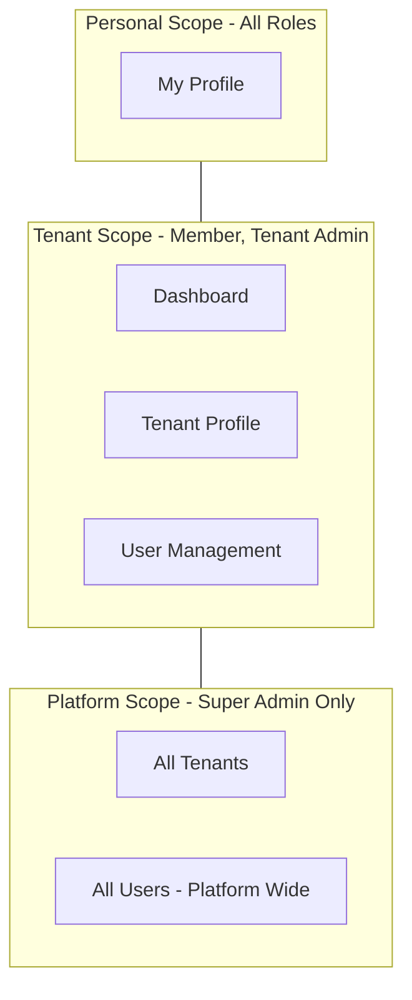
```mermaid
flowchart TD
    subgraph Scope1[Personal Scope - All Roles]
        Profile[My Profile]
    end
    subgraph Scope2[Tenant Scope - Member, Tenant Admin]
        Dashboard[Dashboard]
        TenantProfile[Tenant Profile]
        Users[User Management]
    end
    subgraph Scope3[Platform Scope - Super Admin Only]
        AllTenants[All Tenants]
        AllUsers[All Users - Platform Wide]
    end

    Scope1 --- Scope2
    Scope2 --- Scope3
```

### 2.1 Content Grouping

| Group | Screens | Available To |
|---|---|---|
| **Public / Unauthenticated** | Register, Login | Visitors |
| **Personal** | My Profile | All authenticated roles |
| **Tenant Operations** | Dashboard, Tenant Profile, User Management | Member (partial), Tenant Admin, Super Admin |
| **Platform Operations** | All Tenants, All Users (platform-wide) | Super Admin only |

---

## 3. Application Navigation & Sitemap

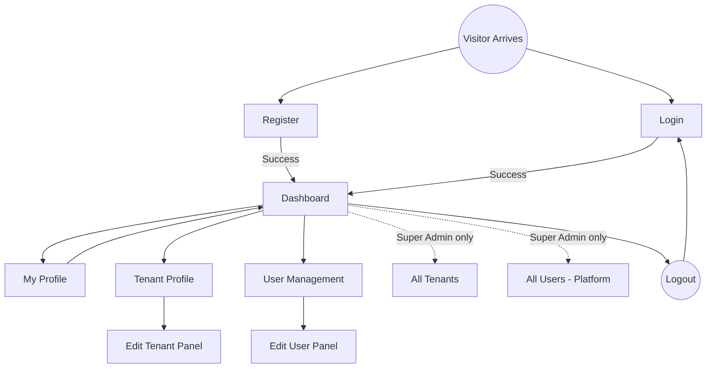
```mermaid
flowchart TD
    Start((Visitor Arrives)) --> Login[Login]
    Start --> Register[Register]

    Register -->|Success| Dashboard
    Login -->|Success| Dashboard[Dashboard]

    Dashboard --> Profile[My Profile]
    Dashboard --> TenantProfile[Tenant Profile]
    Dashboard --> UserMgmt[User Management]

    UserMgmt --> UserDetail[Edit User Panel]
    TenantProfile --> TenantEdit[Edit Tenant Panel]

    Dashboard -.Super Admin only.-> AllTenants[All Tenants]
    Dashboard -.Super Admin only.-> AllUsers[All Users - Platform]

    Profile --> Dashboard
    Dashboard --> Logout((Logout))
    Logout --> Login
```

### 3.1 Primary Navigation (Persistent Shell)

| Nav Item | Icon Concept | Visible To |
|---|---|---|
| Dashboard | Home/grid | All authenticated roles |
| User Management | People | Tenant Admin, Super Admin |
| Tenant Profile | Building/briefcase | All authenticated roles (view); edit for Tenant Admin+ |
| All Tenants | Layers/globe | Super Admin only |
| My Profile | User avatar (top-right menu) | All authenticated roles |
| Logout | Exit icon (top-right menu) | All authenticated roles |

---

## 4. Screen Inventory

| # | Screen | Route Concept | Primary Roles |
|---|---|---|---|
| 1 | Register | `/register` | Visitor |
| 2 | Login | `/login` | Visitor |
| 3 | Dashboard | `/dashboard` | Member, Tenant Admin, Super Admin |
| 4 | Tenant Profile (View) | `/tenant` | Member, Tenant Admin, Super Admin |
| 5 | Tenant Profile (Edit) | `/tenant/edit` (or modal) | Tenant Admin, Super Admin |
| 6 | User Management (List) | `/users` | Tenant Admin, Super Admin |
| 7 | Create/Edit User (Panel/Modal) | `/users/new`, `/users/:id` | Tenant Admin, Super Admin |
| 8 | My Profile (View/Edit) | `/profile` | All authenticated roles |
| 9 | All Tenants (Platform) | `/admin/tenants` | Super Admin |
| 10 | All Users (Platform) | `/admin/users` | Super Admin |
| 11 | 403 / Access Denied | N/A (shown in-place) | All (contextual) |
| 12 | 404 / Not Found | N/A | All |

---

## 5. Page Hierarchy

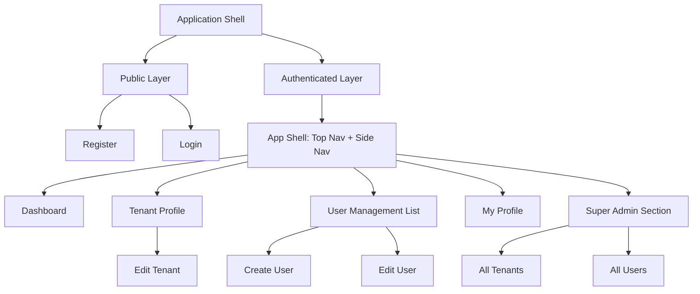
```mermaid
flowchart TD
    Root[Application Shell]
    Root --> Public[Public Layer]
    Root --> Authenticated[Authenticated Layer]

    Public --> P1[Register]
    Public --> P2[Login]

    Authenticated --> Shell[App Shell: Top Nav + Side Nav]
    Shell --> D[Dashboard]
    Shell --> T[Tenant Profile]
    T --> TE[Edit Tenant]
    Shell --> U[User Management List]
    U --> UC[Create User]
    U --> UE[Edit User]
    Shell --> Pr[My Profile]
    Shell --> SA[Super Admin Section]
    SA --> SAT[All Tenants]
    SA --> SAU[All Users]
```

---

## 6. Authentication Flow

### 6.1 Login Flow Diagram

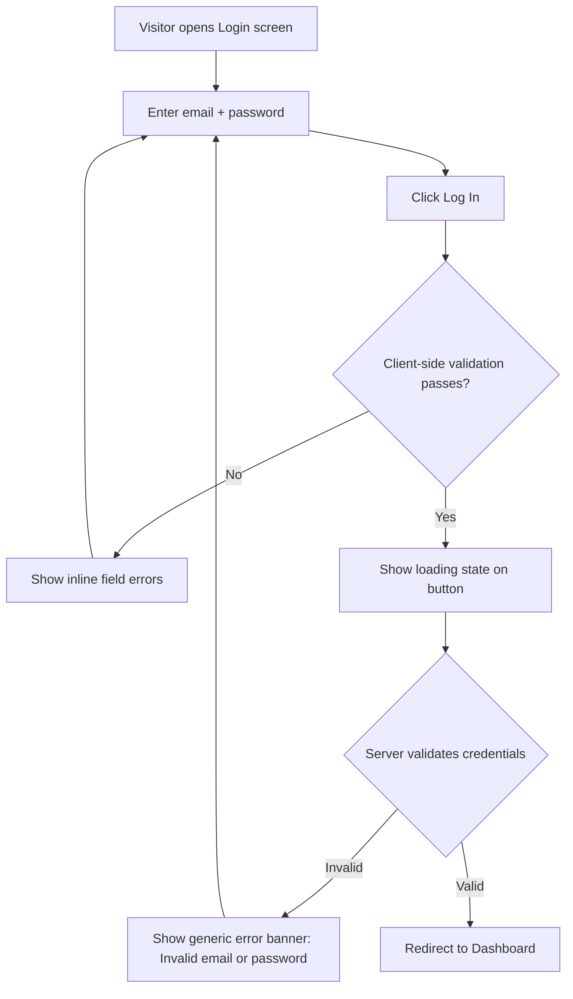
```mermaid
flowchart TD
    A[Visitor opens Login screen] --> B[Enter email + password]
    B --> C[Click Log In]
    C --> D{Client-side validation passes?}
    D -- No --> B1[Show inline field errors]
    B1 --> B
    D -- Yes --> E[Show loading state on button]
    E --> F{Server validates credentials}
    F -- Invalid --> G[Show generic error banner: Invalid email or password]
    G --> B
    F -- Valid --> H[Redirect to Dashboard]
```

### 6.2 Authentication State Sequence

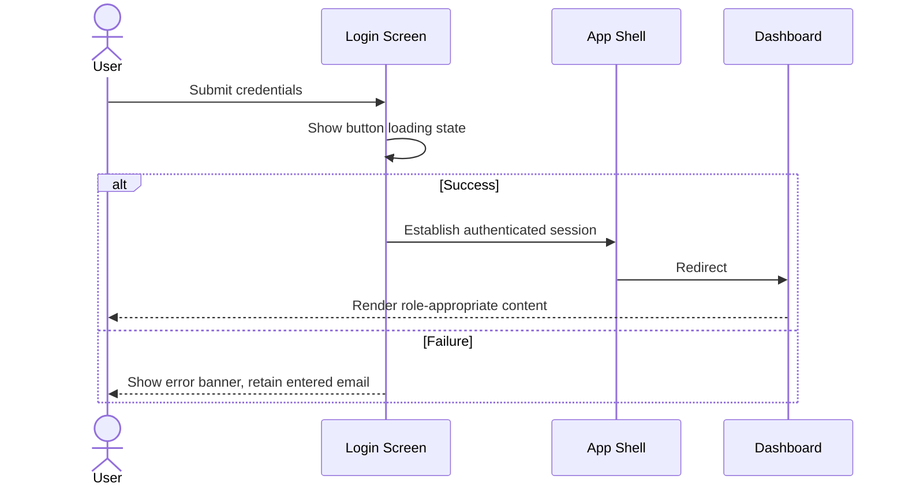
```mermaid
sequenceDiagram
    actor User
    participant Login as Login Screen
    participant Shell as App Shell
    participant Dash as Dashboard

    User->>Login: Submit credentials
    Login->>Login: Show button loading state
    alt Success
        Login->>Shell: Establish authenticated session
        Shell->>Dash: Redirect
        Dash-->>User: Render role-appropriate content
    else Failure
        Login-->>User: Show error banner, retain entered email
    end
```

### 6.3 Route Protection Decision Tree

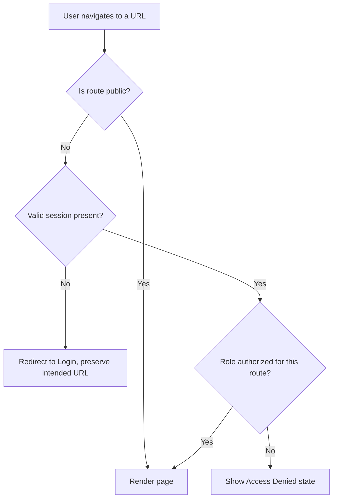
```mermaid
flowchart TD
    A[User navigates to a URL] --> B{Is route public?}
    B -- Yes --> C[Render page]
    B -- No --> D{Valid session present?}
    D -- No --> E[Redirect to Login, preserve intended URL]
    D -- Yes --> F{Role authorized for this route?}
    F -- No --> G[Show Access Denied state]
    F -- Yes --> C
```

---

## 7. Tenant Creation Flow

Tenant creation is embedded within Registration — there is no standalone "create tenant" screen in the MVP, since every registration produces exactly one new tenant with the registrant as its Tenant Admin.

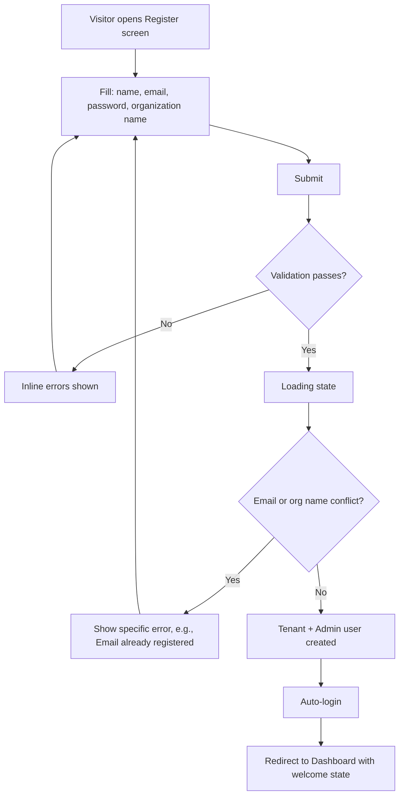
```mermaid
flowchart TD
    A[Visitor opens Register screen] --> B[Fill: name, email, password, organization name]
    B --> C[Submit]
    C --> D{Validation passes?}
    D -- No --> B1[Inline errors shown]
    B1 --> B
    D -- Yes --> E[Loading state]
    E --> F{Email or org name conflict?}
    F -- Yes --> G[Show specific error, e.g., Email already registered]
    G --> B
    F -- No --> H[Tenant + Admin user created]
    H --> I[Auto-login]
    I --> J[Redirect to Dashboard with welcome state]
```

### 7.1 First-Run Experience

On first Dashboard load after registration, the interface should acknowledge the new state explicitly (e.g., a welcome banner or lightweight onboarding checklist: "Invite your team," "Set up your organization profile"), rather than presenting the same view a returning user would see.

---

## 8. Dashboard Flow

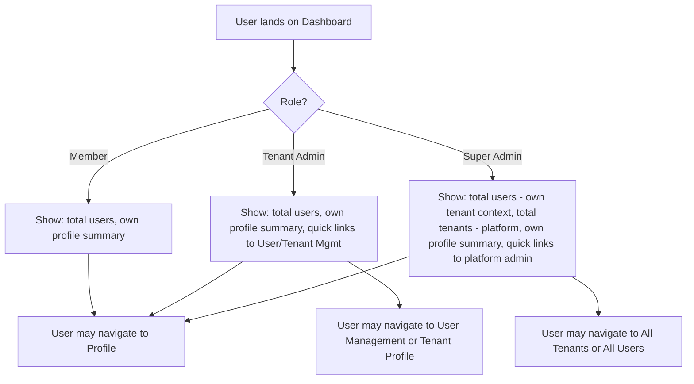
```mermaid
flowchart TD
    A[User lands on Dashboard] --> B{Role?}
    B -- Member --> C[Show: total users, own profile summary]
    B -- Tenant Admin --> D[Show: total users, own profile summary, quick links to User/Tenant Mgmt]
    B -- Super Admin --> E[Show: total users - own tenant context, total tenants - platform, own profile summary, quick links to platform admin]
    C --> F[User may navigate to Profile]
    D --> F
    D --> G[User may navigate to User Management or Tenant Profile]
    E --> F
    E --> H[User may navigate to All Tenants or All Users]
```

### 8.1 Dashboard Widget Matrix

| Widget | Member | Tenant Admin | Super Admin |
|---|:---:|:---:|:---:|
| Total Users (own tenant) | ✅ | ✅ | ✅ |
| Current User Info Card | ✅ | ✅ | ✅ |
| Total Tenants (platform) | ❌ | ❌ | ✅ |
| Quick Link: User Management | ❌ | ✅ | ✅ |
| Quick Link: Tenant Profile | View only | Edit | Edit |
| Quick Link: All Tenants | ❌ | ❌ | ✅ |

---

## 9. Tenant Management Flow

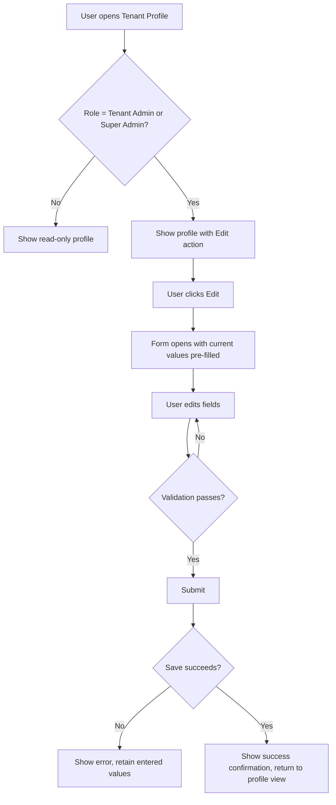
```mermaid
flowchart TD
    A[User opens Tenant Profile] --> B{Role = Tenant Admin or Super Admin?}
    B -- No --> C[Show read-only profile]
    B -- Yes --> D[Show profile with Edit action]
    D --> E[User clicks Edit]
    E --> F[Form opens with current values pre-filled]
    F --> G[User edits fields]
    G --> H{Validation passes?}
    H -- No --> G
    H -- Yes --> I[Submit]
    I --> J{Save succeeds?}
    J -- No --> K[Show error, retain entered values]
    J -- Yes --> L[Show success confirmation, return to profile view]
```

---

## 10. User Management Flow

### 10.1 Create User Flow

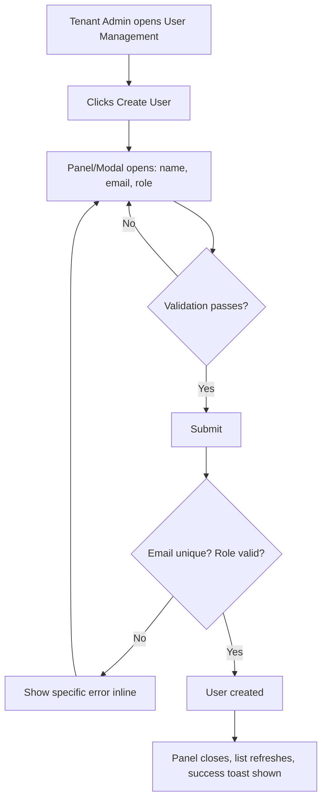
```mermaid
flowchart TD
    A[Tenant Admin opens User Management] --> B[Clicks Create User]
    B --> C[Panel/Modal opens: name, email, role]
    C --> D{Validation passes?}
    D -- No --> C
    D -- Yes --> E[Submit]
    E --> F{Email unique? Role valid?}
    F -- No --> G[Show specific error inline]
    G --> C
    F -- Yes --> H[User created]
    H --> I[Panel closes, list refreshes, success toast shown]
```

### 10.2 Edit / Delete User Flow

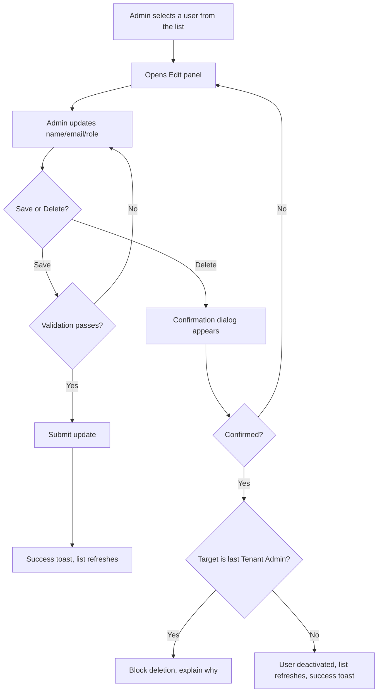
```mermaid
flowchart TD
    A[Admin selects a user from the list] --> B[Opens Edit panel]
    B --> C[Admin updates name/email/role]
    C --> D{Save or Delete?}
    D -- Save --> E{Validation passes?}
    E -- No --> C
    E -- Yes --> F[Submit update]
    F --> G[Success toast, list refreshes]
    D -- Delete --> H[Confirmation dialog appears]
    H --> I{Confirmed?}
    I -- No --> B
    I -- Yes --> J{Target is last Tenant Admin?}
    J -- Yes --> K[Block deletion, explain why]
    J -- No --> L[User deactivated, list refreshes, success toast]
```

### 10.3 User Management Screen Transition Diagram

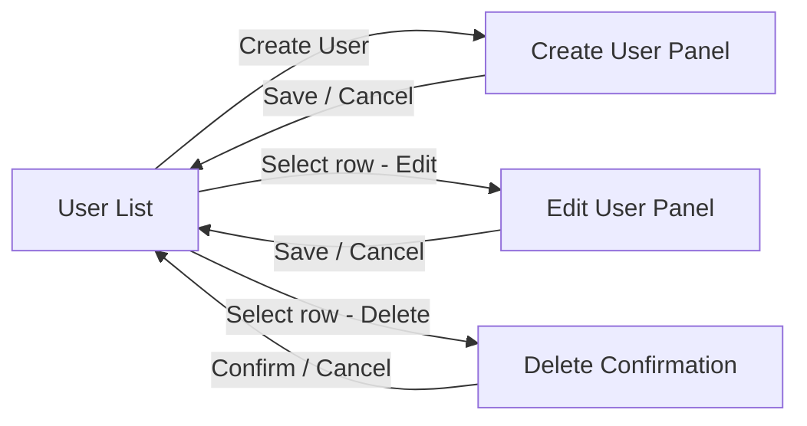
```mermaid
flowchart LR
    List[User List] -->|Create User| CreatePanel[Create User Panel]
    List -->|Select row - Edit| EditPanel[Edit User Panel]
    List -->|Select row - Delete| ConfirmDialog[Delete Confirmation]
    CreatePanel -->|Save / Cancel| List
    EditPanel -->|Save / Cancel| List
    ConfirmDialog -->|Confirm / Cancel| List
```

---

## 11. Profile Management Flow

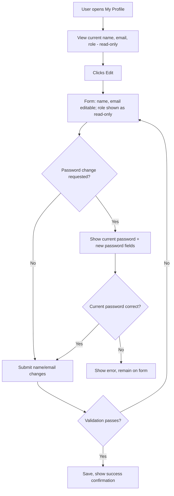
```mermaid
flowchart TD
    A[User opens My Profile] --> B[View current name, email, role - read-only]
    B --> C[Clicks Edit]
    C --> D[Form: name, email editable; role shown as read-only]
    D --> E{Password change requested?}
    E -- Yes --> F[Show current password + new password fields]
    E -- No --> G[Submit name/email changes]
    F --> H{Current password correct?}
    H -- No --> I[Show error, remain on form]
    H -- Yes --> G
    G --> J{Validation passes?}
    J -- No --> D
    J -- Yes --> K[Save, show success confirmation]
```

---

## 12. Role-Based Navigation

### 12.1 Role-Based Navigation Flow

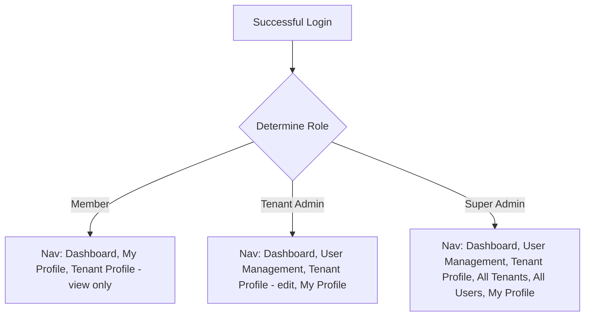
```mermaid
flowchart TD
    Login[Successful Login] --> RoleCheck{Determine Role}
    RoleCheck -- Member --> NavMember[Nav: Dashboard, My Profile, Tenant Profile - view only]
    RoleCheck -- Tenant Admin --> NavAdmin[Nav: Dashboard, User Management, Tenant Profile - edit, My Profile]
    RoleCheck -- Super Admin --> NavSuper[Nav: Dashboard, User Management, Tenant Profile, All Tenants, All Users, My Profile]
```

### 12.2 Navigation Visibility Table

| Nav Item | Member | Tenant Admin | Super Admin |
|---|:---:|:---:|:---:|
| Dashboard | ✅ | ✅ | ✅ |
| Tenant Profile (view) | ✅ | ✅ | ✅ |
| Tenant Profile (edit action visible) | ❌ | ✅ | ✅ |
| User Management | ❌ | ✅ | ✅ |
| All Tenants (platform) | ❌ | ❌ | ✅ |
| All Users (platform) | ❌ | ❌ | ✅ |
| My Profile | ✅ | ✅ | ✅ |
| Logout | ✅ | ✅ | ✅ |

**Design principle:** Navigation items that a role cannot use are **not rendered** (rather than shown disabled/greyed out), to keep the interface uncluttered and avoid implying unreachable functionality. Exception: contextual actions (e.g., an Edit button) may render disabled with a tooltip when the surrounding context is otherwise visible to that role (e.g., viewing a screen where only some actions are restricted).

---

## 13. User Journeys

### 13.1 Journey Map: Priya (Tenant Admin) — First Week

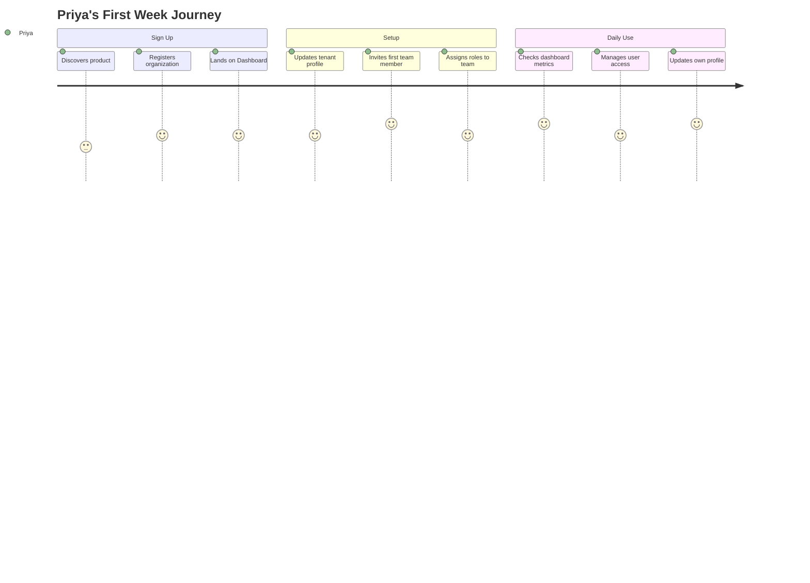
```mermaid
journey
    title Priya's First Week Journey
    section Sign Up
      Discovers product: 3: Priya
      Registers organization: 4: Priya
      Lands on Dashboard: 4: Priya
    section Setup
      Updates tenant profile: 4: Priya
      Invites first team member: 5: Priya
      Assigns roles to team: 4: Priya
    section Daily Use
      Checks dashboard metrics: 5: Priya
      Manages user access: 4: Priya
      Updates own profile: 5: Priya
```

### 13.2 Journey Map: Alex (Member) — First Login

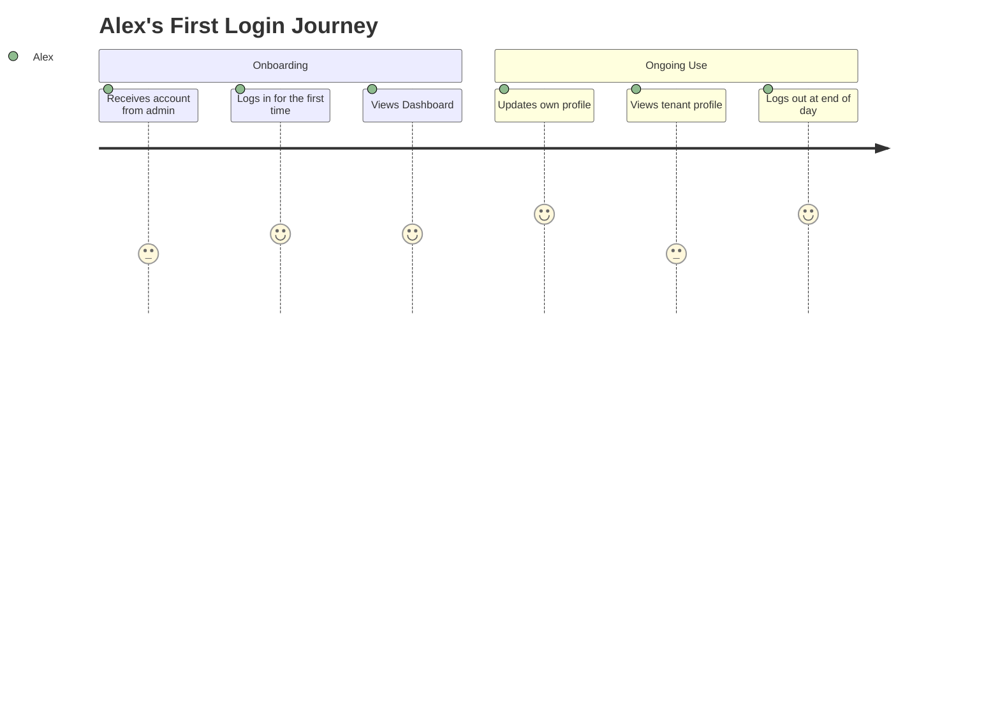
```mermaid
journey
    title Alex's First Login Journey
    section Onboarding
      Receives account from admin: 3: Alex
      Logs in for the first time: 4: Alex
      Views Dashboard: 4: Alex
    section Ongoing Use
      Updates own profile: 5: Alex
      Views tenant profile: 3: Alex
      Logs out at end of day: 5: Alex
```

### 13.3 Journey Map: Sam (Super Admin) — Support Task

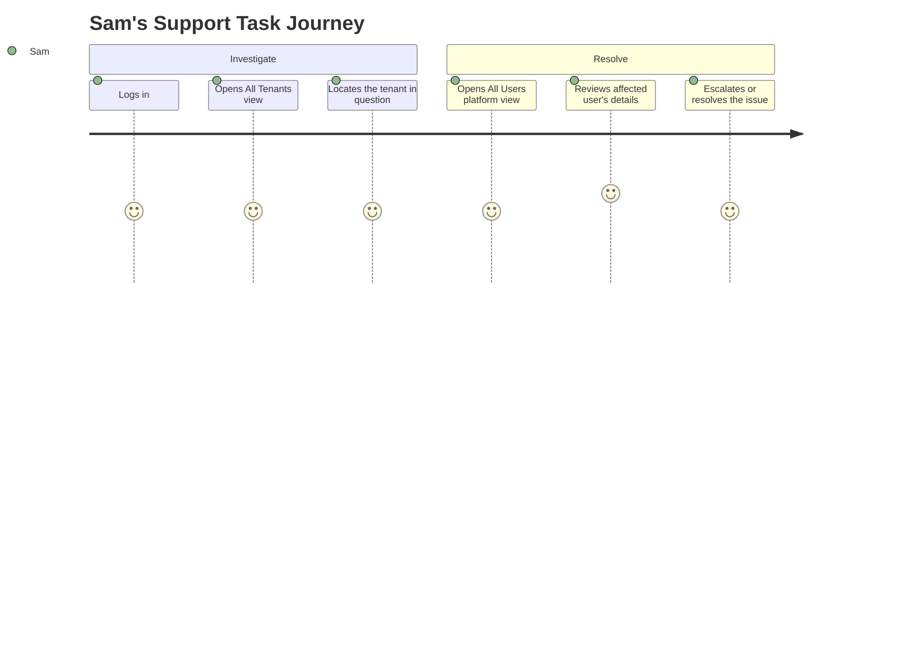
```mermaid
journey
    title Sam's Support Task Journey
    section Investigate
      Logs in: 4: Sam
      Opens All Tenants view: 4: Sam
      Locates the tenant in question: 4: Sam
    section Resolve
      Opens All Users platform view: 4: Sam
      Reviews affected user's details: 5: Sam
      Escalates or resolves the issue: 4: Sam
```

---

## 14. Screen-by-Screen Specification

### 14.1 Register

| Attribute | Detail |
|---|---|
| **Purpose** | Allow a new organization to sign up and create both a tenant and its first admin user |
| **Accessible Roles** | Visitor only |
| **Main Components** | Name field, Email field, Password field, Organization Name field, Submit button, link to Login |
| **User Actions** | Fill form, submit, navigate to Login |
| **Navigation Paths** | On success → Dashboard; "Already have an account?" → Login |
| **Validation Rules** | Name required (2–100 chars); valid email format, unique; password ≥ 8 chars with letter+number; org name required (2–100 chars), unique |
| **Possible States** | Default, field-level error, submitting (loading), server error (e.g., duplicate email), success (redirect) |
| **Success Scenario** | Account + tenant created, user auto-logged-in, redirected to Dashboard with first-run welcome state |
| **Failure Scenarios** | Duplicate email → inline error; duplicate org name → inline error or auto-suggested variant; network failure → retry-capable error banner |

### 14.2 Login

| Attribute | Detail |
|---|---|
| **Purpose** | Authenticate an existing user |
| **Accessible Roles** | Visitor only |
| **Main Components** | Email field, Password field, Submit button, link to Register |
| **User Actions** | Enter credentials, submit, navigate to Register |
| **Navigation Paths** | On success → Dashboard (or originally intended protected URL); "Don't have an account?" → Register |
| **Validation Rules** | Both fields required; email format checked client-side; no password strength check on login (only on registration/change) |
| **Possible States** | Default, field-level error, submitting, invalid-credentials error, success |
| **Success Scenario** | Session established, redirect to Dashboard |
| **Failure Scenarios** | Invalid credentials → generic error, password field cleared, email retained; account deactivated → generic error (no distinguishing detail, to avoid information leakage) |

### 14.3 Dashboard

| Attribute | Detail |
|---|---|
| **Purpose** | Provide an at-a-glance summary of tenant (and, for Super Admin, platform) status |
| **Accessible Roles** | Member, Tenant Admin, Super Admin (content varies) |
| **Main Components** | Metric cards (Total Users, Total Tenants for Super Admin), Current User info card, Quick-action links |
| **User Actions** | View metrics, click through to related screens |
| **Navigation Paths** | → User Management, → Tenant Profile, → My Profile, → All Tenants/All Users (Super Admin) |
| **Validation Rules** | N/A (read-only screen) |
| **Possible States** | Loading (skeleton cards), loaded, partial-error (one widget fails independently), empty (new tenant, minimal data) |
| **Success Scenario** | All metrics load and display accurately |
| **Failure Scenarios** | One or more widgets fail to load → isolated error state per widget with retry, rest of dashboard remains usable |

### 14.4 Tenant Profile (View)

| Attribute | Detail |
|---|---|
| **Purpose** | Display organization details to any tenant member |
| **Accessible Roles** | Member (read-only), Tenant Admin (read + edit access), Super Admin (read + edit access) |
| **Main Components** | Tenant name, description, branding preview, Edit button (role-gated) |
| **User Actions** | View details; click Edit (if authorized) |
| **Navigation Paths** | → Edit Tenant (Tenant Admin/Super Admin only); → Dashboard |
| **Validation Rules** | N/A (view-only) |
| **Possible States** | Loading, loaded, error (failed to fetch) |
| **Success Scenario** | Tenant details render accurately |
| **Failure Scenarios** | Fetch failure → error state with retry option |

### 14.5 Tenant Profile (Edit)

| Attribute | Detail |
|---|---|
| **Purpose** | Allow authorized users to update organization details |
| **Accessible Roles** | Tenant Admin, Super Admin |
| **Main Components** | Editable Name field, Description field, Branding upload, Save/Cancel buttons |
| **User Actions** | Edit fields, save, cancel |
| **Navigation Paths** | Save/Cancel → Tenant Profile (View) |
| **Validation Rules** | Name required (2–100 chars, unique platform-wide); description optional (≤ 500 chars) |
| **Possible States** | Default (pre-filled), editing, submitting, validation error, save error, success |
| **Success Scenario** | Changes persisted, confirmation shown, view refreshed |
| **Failure Scenarios** | Duplicate name → inline error; save failure → error banner, form retains entered values |

### 14.6 User Management (List)

| Attribute | Detail |
|---|---|
| **Purpose** | Give admins visibility and control over the tenant's user roster |
| **Accessible Roles** | Tenant Admin (own tenant), Super Admin (own tenant or, via platform view, all tenants) |
| **Main Components** | Search/filter bar, user table (name, email, role, status), Create User button, row-level actions (Edit, Delete) |
| **User Actions** | Search, filter, create, edit, delete, assign role |
| **Navigation Paths** | → Create User panel, → Edit User panel, → Delete confirmation |
| **Validation Rules** | N/A at list level (validation occurs in Create/Edit panels) |
| **Possible States** | Loading, loaded-with-data, empty (no users besides self), error, filtered-empty (no results for search) |
| **Success Scenario** | User list displays accurately and updates immediately after create/edit/delete |
| **Failure Scenarios** | Fetch failure → error state with retry; action failure surfaces via toast without corrupting the list view |

### 14.7 Create / Edit User (Panel)

| Attribute | Detail |
|---|---|
| **Purpose** | Add a new user to the tenant, or modify an existing one |
| **Accessible Roles** | Tenant Admin, Super Admin |
| **Main Components** | Name field, Email field, Role selector (Member / Tenant Admin only), Save/Cancel, Delete (edit mode only) |
| **User Actions** | Fill/edit fields, select role, save, cancel, delete |
| **Navigation Paths** | Save/Cancel/Delete → User Management (List) |
| **Validation Rules** | Name required (2–100 chars); email required, valid, unique platform-wide; role required, limited to Member/Tenant Admin |
| **Possible States** | Default, editing, submitting, validation error, duplicate-email error, success, delete-confirmation |
| **Success Scenario** | User created/updated, panel closes, list refreshes, success toast shown |
| **Failure Scenarios** | Duplicate email → inline error; attempt to delete last Tenant Admin → blocked with explanation |

### 14.8 My Profile

| Attribute | Detail |
|---|---|
| **Purpose** | Let any user view and manage their own account details |
| **Accessible Roles** | Member, Tenant Admin, Super Admin |
| **Main Components** | Name field, Email field, Role (read-only display), Change Password section, Save/Cancel |
| **User Actions** | Edit name/email, change password, save |
| **Navigation Paths** | Save/Cancel → My Profile (refreshed view) |
| **Validation Rules** | Name required; email required, valid, unique; new password (if provided) ≥ 8 chars with letter+number; current password required to change password |
| **Possible States** | Default, editing, submitting, validation error, incorrect-current-password error, success |
| **Success Scenario** | Profile updated, confirmation shown |
| **Failure Scenarios** | Duplicate email → inline error; wrong current password → inline error, no changes applied |

### 14.9 All Tenants (Platform View)

| Attribute | Detail |
|---|---|
| **Purpose** | Give Super Admins visibility into every tenant on the platform |
| **Accessible Roles** | Super Admin only |
| **Main Components** | Search/filter bar, tenant table (name, user count, created date), row click-through |
| **User Actions** | Search, filter, view tenant detail |
| **Navigation Paths** | → Tenant Profile (in context of selected tenant) |
| **Validation Rules** | N/A (read-only) |
| **Possible States** | Loading, loaded, error, filtered-empty |
| **Success Scenario** | Full, accurate tenant list displayed |
| **Failure Scenarios** | Fetch failure → error state with retry |

### 14.10 All Users (Platform View)

| Attribute | Detail |
|---|---|
| **Purpose** | Give Super Admins visibility into every user across every tenant, for support/oversight purposes |
| **Accessible Roles** | Super Admin only |
| **Main Components** | Search/filter bar (including filter-by-tenant), user table with tenant affiliation column |
| **User Actions** | Search, filter, view user detail |
| **Navigation Paths** | → User detail (read context; edits typically routed through the relevant tenant's User Management) |
| **Validation Rules** | N/A (read-only) |
| **Possible States** | Loading, loaded, error, filtered-empty |
| **Success Scenario** | Accurate, filterable list of all platform users |
| **Failure Scenarios** | Fetch failure → error state with retry |

### 14.11 Access Denied (403)

| Attribute | Detail |
|---|---|
| **Purpose** | Communicate clearly when an authenticated user lacks permission for a requested screen/action |
| **Accessible Roles** | Shown contextually to any role attempting an unauthorized action |
| **Main Components** | Explanation message, link back to Dashboard |
| **User Actions** | Return to Dashboard |
| **Navigation Paths** | → Dashboard |
| **Possible States** | Static (no sub-states) |
| **Success Scenario** | N/A — this is itself a boundary state |
| **Failure Scenarios** | N/A |

---

## 15. Form Behavior & Validation

### 15.1 General Principles

- **Validate on blur and on submit**, not on every keystroke, to avoid premature error noise while typing.
- Once a field has been marked invalid, re-validate on each subsequent change so the error clears as soon as it's resolved.
- Submit buttons are disabled while a request is in flight, showing a loading indicator, to prevent duplicate submissions.
- Server-side validation errors are mapped back to the relevant field wherever possible; otherwise shown as a form-level banner.
- Destructive or irreversible actions (delete, role change away from admin) require explicit confirmation (see Section 17).

### 15.2 Field-Level Validation Summary

| Field | Applies To | Rule |
|---|---|---|
| Name | Register, Create/Edit User, Profile | Required, 2–100 characters |
| Email | Register, Login, Create/Edit User, Profile | Required, valid format, unique platform-wide (except Login, which only checks format) |
| Password | Register, Profile (change) | Required, ≥ 8 characters, letter + number mix |
| Current Password | Profile (change) | Required if changing password; must match existing |
| Organization Name | Register, Tenant Edit | Required, 2–100 characters, unique platform-wide |
| Description | Tenant Edit | Optional, ≤ 500 characters |
| Role | Create/Edit User | Required, one of Member / Tenant Admin (Super Admin not selectable) |

### 15.3 Form State Diagram

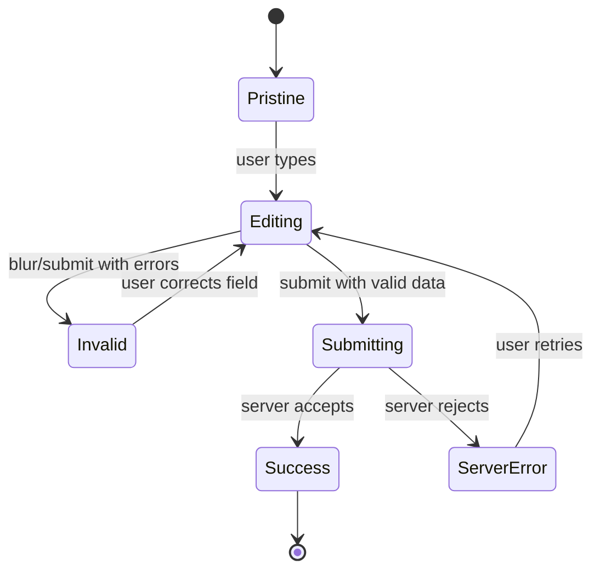
```mermaid
stateDiagram-v2
    [*] --> Pristine
    Pristine --> Editing: user types
    Editing --> Invalid: blur/submit with errors
    Invalid --> Editing: user corrects field
    Editing --> Submitting: submit with valid data
    Submitting --> Success: server accepts
    Submitting --> ServerError: server rejects
    ServerError --> Editing: user retries
    Success --> [*]
```

---

## 16. Loading, Empty, Success & Error States

### 16.1 Loading States

| Context | Pattern |
|---|---|
| Full-page data fetch (e.g., Dashboard first load) | Skeleton layout matching final content shape |
| List data (e.g., User Management table) | Skeleton rows |
| Form submission | Button-level spinner, disabled form |
| Modal/panel content fetch (e.g., Edit User) | Skeleton form fields within the panel |

### 16.2 Empty States

| Screen | Empty Condition | Message Pattern |
|---|---|---|
| User Management | Only the admin exists so far | "No team members yet — invite your first user" with a prominent Create User action |
| User Management (filtered) | Search/filter yields no matches | "No users match your search" with a Clear Filters action |
| All Tenants (Super Admin) | Hypothetical zero-tenant state | "No tenants yet" (not expected in production, but handled gracefully) |
| Dashboard | New tenant, minimal data | Metrics show accurate low numbers (e.g., "1 user"), not treated as an error |

### 16.3 Success States

| Action | Feedback Pattern |
|---|---|
| Form save (Profile, Tenant, User) | Toast notification + updated view reflects new data immediately |
| User created | Toast + new row appears in list (optimistic or refetch) |
| User deleted | Toast + row removed from list |
| Login/Register | Immediate redirect; no separate "success" screen needed |

### 16.4 Error States

| Error Type | Pattern |
|---|---|
| Field-level validation | Inline message directly under the field, red accent |
| Form-level/server error | Banner at top of form, does not clear entered data |
| List/page fetch failure | Centered message with explanation + Retry button, rest of shell remains navigable |
| Widget-level failure (Dashboard) | Localized error within that widget only; other widgets unaffected |
| Unauthorized action | Access Denied state or inline "not permitted" message, never a raw technical error |
| Network/timeout | Generic, friendly message distinguishing "connection issue" from "something went wrong" |

---

## 17. Confirmation Dialogs

Confirmation dialogs are required before any **irreversible or high-impact** action.

| Action | Dialog Copy Pattern | Primary Button | Secondary Button |
|---|---|---|---|
| Delete user | "Remove [Name] from [Tenant]? They will lose access immediately." | Remove (destructive styling) | Cancel |
| Attempt to delete last Tenant Admin | "This is the only admin for [Tenant]. Assign another admin before removing this user." (blocking, informational — not a standard confirm/cancel) | Acknowledge | — |
| Demote own role (if ever surfaced) | "You are changing your own role. You may lose access to admin features." | Confirm | Cancel |
| Logout | Typically no confirmation required (low-risk, reversible via re-login) | — | — |
| Discard unsaved form changes | "You have unsaved changes. Discard them?" | Discard | Keep Editing |

### 17.1 Confirmation Decision Flow

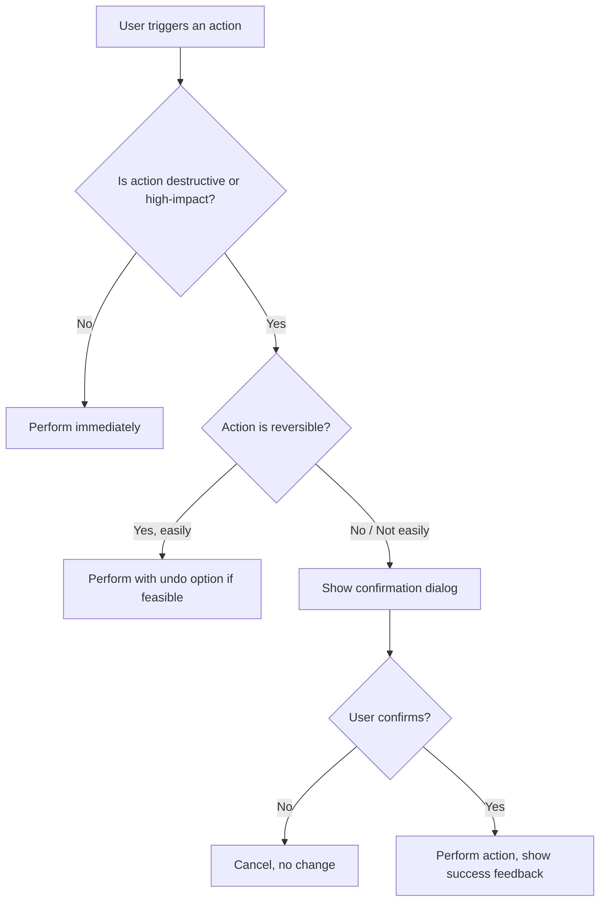
```mermaid
flowchart TD
    A[User triggers an action] --> B{Is action destructive or high-impact?}
    B -- No --> C[Perform immediately]
    B -- Yes --> D{Action is reversible?}
    D -- Yes, easily --> E[Perform with undo option if feasible]
    D -- No / Not easily --> F[Show confirmation dialog]
    F --> G{User confirms?}
    G -- No --> H[Cancel, no change]
    G -- Yes --> I[Perform action, show success feedback]
```

---

## 18. Responsive Behavior

| Breakpoint | Layout Behavior |
|---|---|
| **Desktop (≥1024px)** | Persistent left sidebar navigation; multi-column dashboard grid; tables shown in full with all columns |
| **Tablet (768–1023px)** | Collapsible sidebar (icon-only or drawer); dashboard grid reduces to 2 columns; tables may hide secondary columns behind a "details" expansion |
| **Mobile (<768px)** | Sidebar becomes a bottom nav bar or hamburger-triggered drawer; dashboard stacks to single column; tables convert to stacked card layout per row; forms and panels open as full-screen views rather than modals |

### 18.1 Responsive Priorities by Screen

| Screen | Desktop | Tablet | Mobile |
|---|---|---|---|
| Dashboard | Grid of metric cards | 2-column grid | Stacked cards |
| User Management List | Full table | Condensed table | Card list, tap to expand actions |
| Create/Edit User | Side panel | Side panel or modal | Full-screen view |
| Tenant Profile | Two-column (info + preview) | Single column | Single column |
| My Profile | Centered form, max-width | Centered form | Full-width form |

---

## 19. Dark/Light Mode Behavior

- The application supports both light and dark themes, respecting the user's system preference by default, with a manual override available from the app shell.
- Theme selection persists across sessions for the individual user (a personal preference, not a tenant-wide setting).
- All status/semantic colors (error red, success green, warning amber) maintain sufficient contrast in both themes — the palette is adjusted per theme, not simply inverted.
- Data visualizations and metric cards use theme-aware surface and border colors so they remain legible without a jarring "flash" when the theme is toggled.
- Avoid theme-dependent logic in content meaning (e.g., color must never be the sole indicator of state — always pair with icon/text).

---

## 20. Accessibility Considerations

| Area | Requirement |
|---|---|
| **Keyboard Navigation** | All interactive elements (nav links, buttons, form fields, table row actions) must be reachable and operable via keyboard alone, in a logical tab order |
| **Focus Management** | Opening a modal/panel moves focus into it; closing returns focus to the triggering element |
| **Screen Reader Support** | All form fields have associated labels; error messages are announced via `aria-live` regions; icon-only buttons have accessible names |
| **Color Contrast** | Text and interactive elements meet WCAG 2.1 AA contrast ratios in both light and dark themes |
| **Status Communication** | Loading, success, and error states are conveyed through text/icon, not color alone |
| **Form Errors** | Errors are programmatically associated with their fields (not just visually adjacent) |
| **Confirmation Dialogs** | Trap focus within the dialog while open; dismissible via Escape key |
| **Touch Targets** | Minimum comfortable tap target size on mobile/tablet layouts for all actionable elements |

---

## 21. UX Best Practices & Design Guidelines

### 21.1 General Principles
- **Progressive disclosure:** show only what's relevant to the current role and context; advanced/admin controls stay out of the way for Members.
- **Consistent action placement:** primary actions (Save, Create) are always positioned consistently (e.g., bottom-right of forms/panels) across the application.
- **Immediate, honest feedback:** every user action results in a visible response — loading, success, or error — never silence.
- **Non-blocking errors where possible:** isolate failures to the smallest relevant unit (a widget, a row) rather than breaking the whole page.
- **Predictable navigation:** breadcrumbs or clear back-paths from nested views (e.g., Edit User panel) back to their parent list.

### 21.2 Content & Copy Guidelines
- Error messages state what happened and, where possible, what to do next — avoid raw technical/system error text.
- Empty states are framed as opportunities ("Invite your first user") rather than dead ends.
- Confirmation dialogs use specific language naming the affected entity (e.g., the user's name), not generic "Are you sure?"

### 21.3 Visual Design Guidelines
- Use a consistent, limited color palette with clear semantic meaning (error, success, warning, informational).
- Maintain visual hierarchy: page title → primary action → secondary content, consistently across screens.
- Use shadcn/ui component patterns consistently (buttons, inputs, dialogs, tables) to minimize learned-interaction cost across the app.

---

## 22. Future UX Improvements

| Improvement | Rationale |
|---|---|
| Guided onboarding checklist on first login | Reduce time-to-value for new Tenant Admins |
| Bulk actions in User Management (multi-select delete/role-assign) | Efficiency for larger teams |
| In-app notifications/activity feed | Keep users informed of relevant changes without leaving the app |
| Global search across users/tenants (Super Admin) | Faster support workflows |
| Undo affordance for recent destructive actions | Reduce anxiety around irreversible actions |
| Customizable Dashboard widgets | Let power users tailor their view |
| Inline role/permission tooltips | Help users understand why an action is unavailable, without needing external documentation |

---

*End of Document*