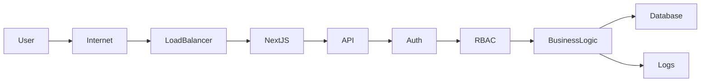
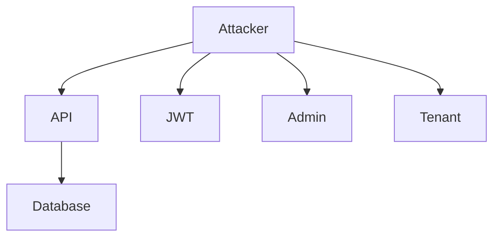
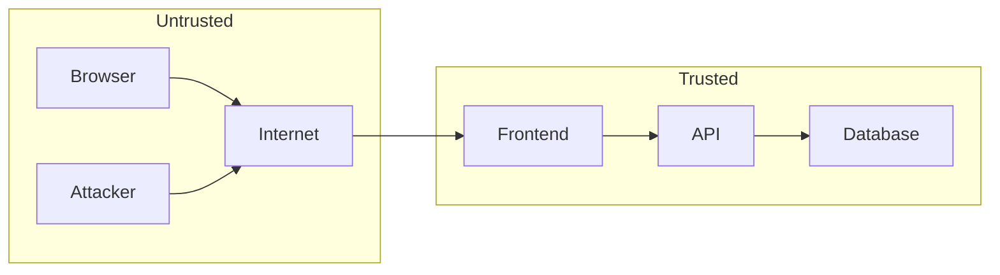
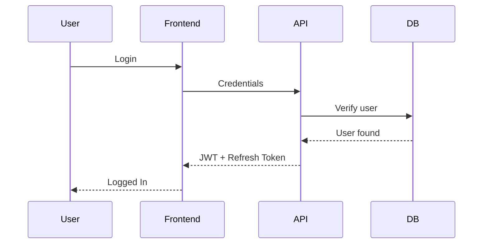
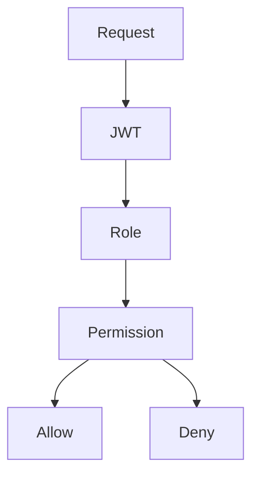
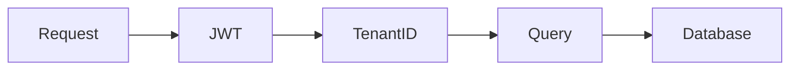
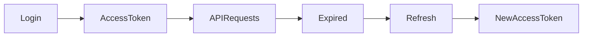
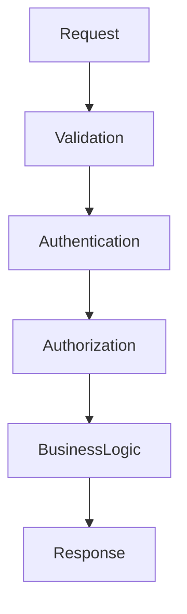
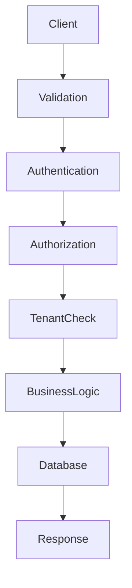

# Security Design Document
## Multi-Tenant SaaS MVP

**Version:** 1.0  
**Status:** Draft  
**Audience:** Developers, Security Engineers, DevOps Engineers, QA Engineers, Architects, Technical Reviewers

---

# Table of Contents

1. Security Overview
2. Security Objectives
3. Security Principles
4. Security Architecture
5. Threat Model
6. Trust Boundary
7. Authentication Security
8. Authorization & RBAC
9. Tenant Isolation Strategy
10. JWT Security
11. Password Security
12. Session Management
13. Route & API Protection
14. Input Validation & Output Sanitization
15. File & Environment Security
16. Database Security
17. Secrets Management
18. HTTPS & Transport Security
19. CORS Strategy
20. Security Headers
21. Error Handling & Information Disclosure
22. Logging & Monitoring
23. Audit Logging
24. Security Testing
25. Backup & Recovery
26. Incident Response
27. Common Attack Vectors
28. Security Assumptions
29. Future Security Enhancements
30. Security Checklist

---

# 1. Security Overview

The Multi-Tenant SaaS MVP is designed with security as a foundational concern. Since multiple organizations (tenants) share the same application infrastructure, strong isolation, authentication, authorization, and data protection mechanisms are required.

The security architecture follows a layered defense strategy where every request is authenticated, authorized, validated, and isolated before business logic is executed.

Core security goals include:

- Strong authentication
- Tenant data isolation
- Least privilege access
- Secure API communication
- Secure credential handling
- Protection against common web attacks
- Complete auditability
- Secure operational practices

---

# 2. Security Objectives

| Objective | Description |
|-----------|-------------|
| Confidentiality | Prevent unauthorized data access |
| Integrity | Prevent unauthorized modification |
| Availability | Maintain service reliability |
| Tenant Isolation | Prevent cross-tenant access |
| Authentication | Verify user identity |
| Authorization | Enforce least privilege |
| Auditability | Record important security events |
| Compliance Readiness | Follow industry best practices |

---

# 3. Security Principles

The application follows these principles:

- Defense in Depth
- Least Privilege
- Secure by Default
- Fail Securely
- Zero Trust
- Input Validation
- Output Encoding
- Principle of Complete Mediation
- Separation of Duties
- Minimize Attack Surface

---

# 4. Security Architecture

---

# 5. Threat Model

Potential threats include:

| Threat | Risk |
|---------|------|
| Stolen JWT | High |
| SQL Injection | High |
| Cross Site Scripting | High |
| Broken Access Control | Critical |
| IDOR | Critical |
| Brute Force | Medium |
| Credential Stuffing | High |
| Replay Attack | Medium |
| Clickjacking | Medium |
| Session Hijacking | High |
| Sensitive Data Exposure | Critical |
| Privilege Escalation | Critical |

---

## Threat Model Diagram

---

# 6. Trust Boundary

---

# 7. Authentication Security

Authentication uses JWT.

Security measures:

- Secure password hashing
- Short-lived access tokens
- Refresh tokens
- Secure logout
- Password complexity rules
- Login rate limiting
- Account lockout after repeated failures
- Email verification (future)
- MFA ready architecture

---

## Authentication Flow

---

# 8. Authorization & RBAC

Authorization occurs after authentication.

Each request validates:

1. JWT
2. User identity
3. Tenant
4. Role
5. Required permission

---

## Authorization Flow

---

## Roles

| Role | Description |
|------|-------------|
| Super Admin | Platform administrator |
| Tenant Admin | Organization administrator |
| Member | Standard user |

---

## RBAC Permission Matrix

| Permission | Super Admin | Tenant Admin | Member |
|------------|------------|-------------|--------|
| Manage Platform | ✅ | ❌ | ❌ |
| Create Tenant | ✅ | ❌ | ❌ |
| Delete Tenant | ✅ | ❌ | ❌ |
| View Tenant | ✅ | ✅ | ✅ |
| Update Tenant | ✅ | ✅ | ❌ |
| Invite Users | ✅ | ✅ | ❌ |
| Remove Users | ✅ | ✅ | ❌ |
| Manage Roles | ✅ | ✅ | ❌ |
| View Dashboard | ✅ | ✅ | ✅ |
| Manage Profile | ✅ | ✅ | ✅ |
| View Users | ✅ | ✅ | Limited |
| Update Own Profile | ✅ | ✅ | ✅ |

---

## Authorization Enforcement

Every protected endpoint:

1. Verify JWT
2. Validate signature
3. Check expiration
4. Extract tenant
5. Extract role
6. Verify permission
7. Execute business logic

No controller or service bypasses authorization checks.

---

# 9. Tenant Isolation Strategy

Each record contains:

- tenant_id

Every query is automatically scoped using tenant_id.

No request may access data outside its tenant.

---

## Tenant Isolation Flow

---

# 10. JWT Security

JWT contains:

- user id
- tenant id
- role
- expiration
- issued at

Never store:

- passwords
- secrets
- permissions list
- sensitive business data

---

## JWT Lifecycle

---

JWT Best Practices

- Short expiration
- HTTPS only
- Signature verification
- Rotation support
- Refresh token revocation
- Clock skew tolerance

---

# 11. Password Security

Passwords are:

- Never stored in plaintext
- Hashed using Argon2id or bcrypt
- Individually salted
- Compared securely

Password policy:

| Requirement | Value |
|------------|-------|
| Minimum Length | 8+ |
| Uppercase | Recommended |
| Lowercase | Required |
| Number | Required |
| Special Character | Recommended |

---

# 12. Session Management

Access Token

- Short lifespan

Refresh Token

- Longer lifespan
- Rotated
- Revocable

Logout

- Refresh token invalidated
- Client removes access token

---

# 13. Route & API Protection

Protected endpoints require:

- Valid JWT
- Valid tenant
- Valid role
- Permission check

Public endpoints

- Login
- Health
- Registration (if enabled)

---

# 14. Input Validation & Output Sanitization

Validation occurs at:

- Client
- API
- Database constraints

Validation includes:

- Required fields
- Type checking
- Length
- Regex
- Enum validation

Output

- Escape HTML
- Encode dynamic content
- Never trust user input

---

## Request Validation Flow

---

# 15. File & Environment Security

Environment variables:

- Never committed
- Stored securely
- Separate by environment

Sensitive values

- JWT Secret
- Database URL
- API Keys

Uploads

- Validate MIME type
- Validate extension
- File size limit
- Virus scanning (future)

---

# 16. Database Security

Security controls

- Least privilege database user
- Prepared queries
- Parameterized SQL
- Connection pooling
- Foreign keys
- Constraints
- Backups
- Encryption at rest

---

# 17. Secrets Management

Secrets include

- JWT secret
- Database credentials
- API keys

Best practices

- Environment variables
- Secret rotation
- No hardcoding
- Restricted access

---

# 18. HTTPS & Transport Security

Requirements

- HTTPS only
- TLS 1.2+
- HSTS enabled
- Secure cookies
- Certificate management

---

# 19. CORS Strategy

Allowed

- Trusted frontend origins

Blocked

- Unknown origins

Configuration

- Specific origins
- Restricted methods
- Restricted headers
- Credentials only when necessary

---

# 20. Security Headers

Recommended headers

| Header | Purpose |
|---------|----------|
| CSP | Reduce XSS |
| HSTS | HTTPS enforcement |
| X-Frame-Options | Prevent Clickjacking |
| X-Content-Type-Options | Prevent MIME sniffing |
| Referrer-Policy | Privacy |
| Permissions-Policy | Browser capability control |

---

# 21. Error Handling & Information Disclosure

Never expose

- Stack traces
- SQL queries
- Secrets
- Internal paths
- Database errors

Responses should return

- Generic messages
- Appropriate HTTP status
- Correlation ID

---

# 22. Logging & Monitoring

Log

- Login attempts
- Failed authentication
- Permission failures
- Tenant switching
- User creation
- Role changes
- Critical API usage
- Server errors

Never log

- Passwords
- JWTs
- Secrets
- Credit card data
- Personal sensitive information

---

# 23. Audit Logging

Audit events

| Event | Logged |
|---------|--------|
| Login | Yes |
| Logout | Yes |
| Password Change | Yes |
| User Creation | Yes |
| User Deletion | Yes |
| Role Change | Yes |
| Tenant Creation | Yes |
| Tenant Update | Yes |
| Tenant Delete | Yes |

Audit fields

- Timestamp
- User
- Tenant
- Action
- Resource
- IP
- User Agent

---

# 24. Security Testing

Testing includes

- Authentication testing
- Authorization testing
- SQL Injection testing
- XSS testing
- CSRF validation
- Rate limiting verification
- JWT tampering
- IDOR testing
- Penetration testing
- Dependency vulnerability scanning

---

# 25. Backup & Recovery

Recommendations

- Automated daily backups
- Encrypted backups
- Multiple retention periods
- Restore testing
- Disaster recovery documentation

Recovery goals

| Metric | Target |
|---------|---------|
| RPO | <24 Hours |
| RTO | <4 Hours |

---

# 26. Incident Response

Steps

1. Detect
2. Analyze
3. Contain
4. Eradicate
5. Recover
6. Review
7. Improve

Incidents

- Credential leak
- Database compromise
- Tenant data exposure
- Unauthorized access
- API abuse

---

# 27. Common Attack Vectors

| Attack | Mitigation |
|---------|------------|
| SQL Injection | Parameterized queries |
| XSS | Output encoding + CSP |
| CSRF | SameSite cookies, CSRF tokens if cookie auth is introduced |
| IDOR | Ownership validation + tenant checks |
| Broken Authentication | Secure JWT + strong passwords |
| Broken Access Control | RBAC middleware |
| Clickjacking | X-Frame-Options |
| Replay Attack | Token expiration + HTTPS |
| Brute Force | Rate limiting + lockout |
| Credential Stuffing | MFA (future), rate limiting, monitoring |
| Session Hijacking | HTTPS + secure token storage |
| Information Disclosure | Generic errors |
| Privilege Escalation | Permission validation |
| SSRF | Validate outbound requests, restrict network access (if external integrations are added) |
| DoS | Rate limiting, request size limits, infrastructure protections |

---

## Secure Request Processing

---

# 28. Security Assumptions

- HTTPS is enforced in production.
- JWT signing keys are securely managed and rotated when necessary.
- Environment secrets are protected by the deployment platform.
- Database access is restricted to the application.
- Infrastructure firewall rules are configured correctly.
- Developers follow secure coding standards.
- Dependencies are regularly updated.

---

# 29. Future Security Enhancements

Planned improvements include:

- Multi-Factor Authentication (MFA)
- Single Sign-On (SAML/OIDC)
- OAuth providers
- Device management
- Refresh token reuse detection
- Session management dashboard
- IP allow/deny lists
- Web Application Firewall (WAF)
- Bot detection
- Distributed rate limiting
- Automated secret rotation
- Security Information and Event Management (SIEM) integration
- Continuous vulnerability scanning
- Data encryption using customer-managed keys
- Immutable audit logs
- Compliance support (SOC 2, ISO 27001)

---

# 30. Security Checklist

| Category | Status |
|----------|--------|
| HTTPS Enabled | ✓ |
| JWT Authentication | ✓ |
| RBAC | ✓ |
| Tenant Isolation | ✓ |
| Input Validation | ✓ |
| Output Encoding | ✓ |
| Password Hashing | ✓ |
| Secure Secrets | ✓ |
| Environment Separation | ✓ |
| Logging | ✓ |
| Audit Logs | ✓ |
| Database Constraints | ✓ |
| SQL Injection Protection | ✓ |
| XSS Protection | ✓ |
| IDOR Protection | ✓ |
| Brute Force Protection | ✓ |
| Secure Headers | ✓ |
| CORS Configuration | ✓ |
| Backup Strategy | ✓ |
| Incident Response Plan | ✓ |
| Security Testing | ✓ |
| Dependency Scanning | ✓ |
| Future MFA Support | Planned |

---

# Conclusion

This Security Design Document defines a defense-in-depth architecture for the Multi-Tenant SaaS MVP. Security is enforced through multiple layers, including strong authentication, role-based authorization, tenant-aware data isolation, strict request validation, secure transport, comprehensive logging, and proactive monitoring. By combining least-privilege access, secure operational practices, and continuous testing, the system establishes a strong foundation that can be expanded with advanced capabilities such as MFA, SSO, SIEM integration, and compliance frameworks as the platform evolves.